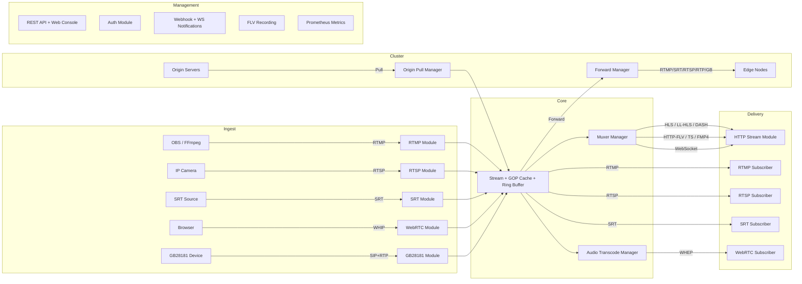

<div align="center">

# LiveForge

**High-performance multi-protocol live streaming server written in Go**

[](https://go.dev)
[](LICENSE)
[](#testing)

[English](README.md) | [中文](README.zh-CN.md)

---

**[📖 Wiki Documentation (EN)](../../wiki) | [📖 Wiki 文档 (中文)](../../wiki/Home-zh)**

*Full guides on deployment, configuration, cluster topologies, GB28181, audio transcoding, and more.*

</div>

---

LiveForge is a modular live streaming media server that ingests, transmuxes, and delivers audio/video in real time. It supports RTMP, RTSP, SRT, WebRTC (WHIP/WHEP), HLS, LL-HLS, DASH, HTTP-FLV, FMP4, GB28181, and WebSocket streaming — all from a single binary with zero external dependencies.

## Highlights

| | Feature | Description |
|-|---------|-------------|
| 🔀 | **Any-to-any protocol bridge** | Push RTMP, pull via WebRTC; push WebRTC, pull via HLS — any combination works |
| 🎵 | **On-demand audio transcoding** | Automatic codec bridging (AAC ↔ Opus ↔ G.711 ↔ MP3) between protocols, powered by FFmpeg/libav |
| 📡 | **GB28181 video surveillance** | Full SIP signaling stack, device registration, live invite, playback, PTZ control, alarm handling — plus a built-in device simulator for testing |
| 🌐 | **Multi-protocol cluster** | Origin-edge cascading via RTMP / SRT / RTSP / RTP / GB28181 with HTTP scheduler callback for dynamic topology |
| ⚡ | **LL-HLS** | Low-Latency HLS with fMP4 partial segments, blocking playlist reload (`_HLS_msn`/`_HLS_part`), and delta playlist updates |
| 🖥️ | **Web console** | Built-in real-time dashboard with stream stats, multi-protocol preview, and browser WHIP publish |
| 🛡️ | **Production-ready** | Slow consumer protection (EWMA frame dropping), GCC congestion control, per-IP rate limiting, Prometheus metrics |

## Features

### Protocols

- **Multi-protocol ingest** — Publish via RTMP, RTSP (TCP + UDP), SRT, WebRTC WHIP, or GB28181
- **Multi-protocol playback** — Pull via RTMP, RTSP, SRT, WebRTC WHEP, HLS, LL-HLS, DASH, HTTP-FLV, HTTP-TS, FMP4, or WebSocket
- **SRT** — Secure Reliable Transport with AES encryption, low-latency MPEG-TS delivery (pure Go via `datarhei/gosrt`)
- **WebRTC** — WHIP/WHEP with ICE Lite, GCC send-side bandwidth estimation, and browser-based publish
- **Codec support** — H.264, H.265/HEVC, VP8, VP9, AV1, AAC, Opus, G.711 (μ-law/A-law), MP3

### Audio Transcoding

LiveForge transparently bridges audio codecs between protocols. When a subscriber requires a different audio codec than the publisher provides, on-demand transcoding kicks in automatically — zero configuration needed.

| Publisher → Subscriber | Codec Path | Use Case |
|----------------------|------------|----------|
| RTMP (AAC) → WebRTC (Opus) | AAC → PCM → Opus | Browser playback of RTMP streams |
| WebRTC (Opus) → RTMP (AAC) | Opus → PCM → AAC | Re-stream browser input to CDN |
| GB28181 (G.711) → HLS (AAC) | G.711 → PCM → AAC | Surveillance camera to web player |
| Any → Any | Decode → Resample → Encode | Full codec matrix supported |

Transcoding is **shared per target codec** — multiple subscribers requesting the same codec share one transcode pipeline. When the publisher's codec matches the subscriber's, frames pass through with zero overhead.

> Requires FFmpeg/libav libraries at build time (`CGO_ENABLED=1`). See [Wiki: Audio Transcoding](../../wiki/Audio-Transcoding) for build instructions and details.

### GB28181 Video Surveillance

Full GB/T 28181 national standard support for connecting IP cameras and NVRs:

- **SIP signaling** — Device registration, keepalive monitoring, digest authentication
- **Catalog query** — Automatic device and channel discovery
- **Live invite** — Server-initiated INVITE to pull live video from cameras
- **Recording playback** — Time-range playback of device-side recordings
- **PTZ control** — Pan/tilt/zoom and preset commands per GB28181 Annex A
- **Alarm handling** — Receive and process device alarm notifications
- **MPEG-PS demuxing** — RTP/PS stream receiving with H.264 + AAC extraction
- **REST API** — Full device/channel/session management via `/api/v1/gb28181/*`
- **Streams as first-class citizens** — GB28181 streams appear in the stream hub and can be played via any output protocol (HLS, RTMP, WebRTC, etc.)

> See [Wiki: GB28181 Guide](../../wiki/GB28181) for configuration and usage details.

### GB28181 Device Simulator

A built-in simulator (`tools/gb28181-sim`) emulates a GB28181 IPC camera for acceptance testing:

```bash
# Build and run the simulator
go run ./tools/gb28181-sim -server 127.0.0.1:5060 -fps 25

# Customizable: device ID, domain, transport, keepalive, audio toggle
go run ./tools/gb28181-sim \
  -device-id 34020000001110000001 \
  -domain 3402000000 \
  -transport udp \
  -keepalive 30s \
  -no-audio
```

The simulator performs: SIP REGISTER → periodic keepalive → responds to catalog queries → streams RTP/PS (H.264+AAC) on INVITE → handles BYE.

### Cluster

Multi-protocol forwarding and on-demand origin pull for building CDN-like topologies:

- **Forward (push)** — Automatically push streams to downstream nodes when published
- **Origin pull** — Lazily pull from upstream when a subscriber arrives, with idle timeout
- **Multi-protocol relay** — RTMP, SRT, RTSP, RTP, and GB28181 transports
- **HTTP scheduler** — Dynamic target resolution via external HTTP callback, or static target lists
- **Topologies** — Origin-edge, origin-multi-edge, origin-center-edge (three-tier)
- **Retry & resilience** — Configurable retry count, interval, and backoff

> See [Wiki: Cluster Deployment](../../wiki/Cluster-Deployment) for topology examples and configuration.

### LL-HLS (Low-Latency HLS)

Apple LL-HLS implementation for sub-second latency HLS delivery:

- **Partial segments** — Configurable part duration (default 200ms) for fine-grained delivery
- **Blocking playlist reload** — `_HLS_msn` and `_HLS_part` query parameters for server-push style updates
- **Delta playlist** — `_HLS_skip=YES` support to reduce playlist transfer size
- **fMP4 container** — Default fMP4 with TS fallback option
- **Legacy player compat** — Graceful degradation for players without LL-HLS support (buffered segment delivery)

### Management & Operations

- **Web console** — Real-time dashboard: stream list, codecs, bitrate, FPS, GOP cache, multi-protocol preview, WebRTC browser publish
- **REST API** — List/inspect/delete streams, kick publishers, server stats, health checks
- **Auth** — JWT token verification and HTTP callback authentication for publish and subscribe
- **Recording** — FLV file recording with duration-based segmentation and path templates
- **Notifications** — HTTP webhook (HMAC-SHA256 signed) and WebSocket real-time events
- **Prometheus metrics** — Server-level and per-stream gauges: connections, bitrate, FPS, GOP cache, subscribers by protocol
- **Rate limiting** — Per-IP token bucket for connection flood protection
- **Slow consumer protection** — EWMA-based lag detection with progressive frame dropping
- **GCC congestion control** — Send-side bandwidth estimation for WebRTC WHEP with adaptive bitrate pacing
- **GOP cache** — New subscribers receive the latest keyframe group instantly for fast startup

## Architecture



## Quick Start

### Build and Run

```bash
git clone https://github.com/im-pingo/liveforge.git
cd liveforge
go build -o liveforge ./cmd/liveforge
./liveforge -c configs/liveforge.yaml
```

> To enable audio transcoding, build with CGO and FFmpeg/libav:
> ```bash
> CGO_ENABLED=1 go build -tags audiocodec -o liveforge ./cmd/liveforge
> ```

### Publish a Stream

**RTMP (OBS / FFmpeg):**
```bash
ffmpeg -re -i input.mp4 -c copy -f flv rtmp://localhost:1935/live/stream1
```

**RTSP:**
```bash
ffmpeg -re -i input.mp4 -c copy -f rtsp rtsp://localhost:8554/live/stream1
```

**SRT:**
```bash
ffmpeg -re -i input.mp4 -c copy -f mpegts "srt://localhost:6000?streamid=publish:/live/stream1"
```

**WebRTC (Browser):**
Open `http://localhost:8090/console`, click **"+ WebRTC Publish"**, select camera/mic, and start streaming.

**GB28181:**
Configure your IP camera's SIP server to point at `localhost:5060`, or use the built-in simulator:
```bash
go run ./tools/gb28181-sim -server 127.0.0.1:5060
```

### Play a Stream

| Protocol | URL |
|----------|-----|
| RTMP | `rtmp://localhost:1935/live/stream1` |
| RTSP | `rtsp://localhost:8554/live/stream1` |
| SRT | `srt://localhost:6000?streamid=subscribe:/live/stream1` |
| HLS | `http://localhost:8080/live/stream1.m3u8` |
| LL-HLS | `http://localhost:8080/live/stream1.m3u8` (auto when enabled) |
| DASH | `http://localhost:8080/live/stream1.mpd` |
| HTTP-FLV | `http://localhost:8080/live/stream1.flv` |
| HTTP-TS | `http://localhost:8080/live/stream1.ts` |
| FMP4 | `http://localhost:8080/live/stream1.mp4` |
| WebRTC | Open console → Preview → WebRTC tab |

### Web Console

Open `http://localhost:8090/console` for the real-time management dashboard:

- Live stream list with state, codecs, bitrate, FPS
- GOP cache visualization
- Multi-protocol preview player (HTTP-FLV, WS-FLV, HTTP-TS, FMP4, WebRTC)
- WebRTC publish with camera/mic and outbound stats
- Stream management (kick publisher, delete stream)

## Configuration

LiveForge uses a single YAML configuration file. See [`configs/liveforge.yaml`](configs/liveforge.yaml) for the full reference.

Key sections:

| Section | Purpose |
|---------|---------|
| `rtmp` | RTMP ingest/playback (default `:1935`) |
| `rtsp` | RTSP ingest/playback with TCP + UDP (default `:8554`) |
| `http_stream` | HLS, LL-HLS, DASH, HTTP-FLV, HTTP-TS, FMP4, WebSocket (default `:8080`) |
| `webrtc` | WHIP/WHEP with ICE servers and UDP port range (default `:8443`) |
| `srt` | SRT ingest/playback with AES encryption (default `:6000`) |
| `sip` | SIP signaling server for GB28181 (default `:5060`) |
| `gb28181` | GB28181 device management, RTP port range, keepalive, auto-invite |
| `audio_codec` | Enable/disable on-demand audio transcoding |
| `api` | REST API and web console (default `:8090`) |
| `auth` | JWT and HTTP callback authentication |
| `record` | FLV recording with segmentation |
| `notify` | HTTP webhook and WebSocket notifications |
| `cluster` | Multi-protocol forwarding and origin pull with scheduler |
| `metrics` | Prometheus metrics endpoint (default `:9090`) |
| `limits` | Global connection, stream, and subscriber limits |
| `tls` | TLS certificate and key for HTTPS/secure protocols |
| `stream` | GOP cache, ring buffer, idle timeout, slow consumer, simulcast settings |

Environment variable expansion is supported: `${API_TOKEN}`, `${AUTH_JWT_SECRET}`.

## Testing Tools

### lf-test CLI

A comprehensive integration testing tool (`tools/lf-test`) for validating all server features:

```bash
# Push test (supports: rtmp, rtsp, srt, whip, gb28181)
go run ./tools/lf-test push --protocol rtmp --target rtmp://localhost:1935/live/test

# Play test (supports: rtmp, rtsp, srt, whep, httpflv, wsflv, hls, llhls, dash)
go run ./tools/lf-test play --protocol hls --url http://localhost:8080/live/test.m3u8

# Cluster topology test (auto-launches multi-node cluster)
go run ./tools/lf-test cluster \
  --topology origin-edge \
  --relay-protocol srt \
  --push-protocol rtmp \
  --play-protocol hls

# Auth test
go run ./tools/lf-test auth --target rtmp://localhost:1935/live/test --token <jwt>
```

All commands support `--assert` expressions and `--output json` for CI integration.

### gb28181-sim

See [GB28181 Device Simulator](#gb28181-device-simulator) above.

## Project Structure

```
liveforge/
├── cmd/liveforge/       # Entry point
├── config/              # YAML config loader
├── core/                # Server, Stream, EventBus, StreamHub, MuxerManager, TranscodeManager
├── module/
│   ├── api/             # REST API + web console
│   ├── auth/            # JWT / HTTP callback auth
│   ├── cluster/         # Multi-protocol forwarding + origin pull (RTMP/SRT/RTSP/RTP/GB28181)
│   ├── gb28181/         # GB28181 protocol (SIP signaling, device registry, invite, PTZ, playback, alarm)
│   ├── httpstream/      # HLS, LL-HLS, DASH, HTTP-FLV, HTTP-TS, FMP4, WebSocket
│   ├── metrics/         # Prometheus metrics endpoint
│   ├── notify/          # HTTP webhook + WebSocket notifications
│   ├── record/          # FLV stream recording
│   ├── rtmp/            # RTMP protocol (handshake, chunks, AMF0)
│   ├── rtsp/            # RTSP protocol (TCP + UDP transport)
│   ├── sip/             # SIP transport layer (used by GB28181)
│   ├── srt/             # SRT protocol (via datarhei/gosrt)
│   └── webrtc/          # WebRTC WHIP/WHEP + GCC (via pion/webrtc)
├── pkg/
│   ├── audiocodec/      # Audio transcode: FFmpeg-backed decode/encode/resample (AAC, Opus, G.711, MP3)
│   ├── avframe/         # Audio/video frame types
│   ├── codec/           # H.264, H.265, AAC, AV1, Opus, MP3 parsers
│   ├── logger/          # Structured logging
│   ├── muxer/           # FLV, TS, FMP4, MPEG-PS muxers and demuxers
│   ├── portalloc/       # Port range allocator for RTP
│   ├── ratelimit/       # Per-IP token bucket rate limiter
│   ├── rtp/             # Full RTP/RTCP stack with 12+ codec packetizers
│   ├── sdp/             # SDP parser and builder
│   └── util/            # Lock-free SPMC ring buffer
├── tools/
│   ├── gb28181-sim/     # GB28181 device simulator
│   ├── lf-test/         # Integration test CLI (push, play, auth, cluster)
│   └── testkit/         # Reusable test components (push, play, cluster, analyzer, report)
└── test/integration/    # End-to-end integration tests
```

## Testing

30 test packages, all passing:

```bash
go test ./...
go test -race ./...     # with race detector
go test -cover ./...    # with coverage
```

## Comparison

| Feature | LiveForge | MediaMTX | SRS | Monibuca |
|---------|-----------|----------|-----|----------|
| Language | Go | Go | C++ | Go |
| RTMP | Yes | Yes | Yes | Yes |
| RTSP | Yes (TCP+UDP) | Yes | Yes | Plugin |
| SRT | Yes (pure Go) | Yes | Yes | Plugin |
| WebRTC WHIP/WHEP | Yes | Yes | Yes | Plugin |
| HLS/DASH | Yes | Yes | Yes | Plugin |
| LL-HLS | Yes (fMP4 + blocking reload) | No | Yes | No |
| HTTP-FLV | Yes | No | Yes | Plugin |
| FMP4 streaming | Yes | No | No | No |
| GB28181 | Yes (full SIP + live/playback/PTZ) | No | Yes | Plugin |
| Audio transcoding | Yes (AAC↔Opus↔G.711↔MP3) | No | Yes | Plugin |
| Cluster relay | Yes (RTMP/SRT/RTSP/RTP/GB28181) | No | Yes | Plugin |
| Web console | Yes (built-in) | No | Yes | Yes |
| Browser publish | Yes (WHIP) | No | No | No |
| Auth (JWT + callback) | Yes | Yes | Yes | Plugin |
| Recording | Yes (FLV) | Yes | Yes | Plugin |
| Webhooks | Yes (HMAC-signed) | No | Yes | No |
| ICE Lite | Yes | No | No | No |
| Prometheus metrics | Yes | No | Yes | Plugin |
| GCC congestion control | Yes | No | No | No |
| Testing tools | Yes (lf-test CLI + GB28181 sim) | No | No | No |
| Single binary | Yes | Yes | Yes | No |
| License | MIT | MIT | MIT | MIT |

## Documentation

> **📖 Full documentation is on the [GitHub Wiki](../../wiki).**

| Topic | EN | 中文 |
|-------|-----|------|
| Home | [Wiki Home](../../wiki) | [Wiki 首页](../../wiki/Home-zh) |
| Audio Transcoding | [Audio Transcoding](../../wiki/Audio-Transcoding) | [音频转码](../../wiki/Audio-Transcoding-zh) |
| GB28181 Guide | [GB28181](../../wiki/GB28181) | [GB28181 指南](../../wiki/GB28181-zh) |
| Cluster Deployment | [Cluster Deployment](../../wiki/Cluster-Deployment) | [集群部署](../../wiki/Cluster-Deployment-zh) |
| LL-HLS | [LL-HLS](../../wiki/LLHLS) | [低延迟 HLS](../../wiki/LLHLS-zh) |
| Testing Tools | [Testing Tools](../../wiki/Testing-Tools) | [测试工具](../../wiki/Testing-Tools-zh) |
| Configuration Reference | [Configuration](../../wiki/Configuration) | [配置参考](../../wiki/Configuration-zh) |
| REST API | [REST API](../../wiki/REST-API) | [REST API](../../wiki/REST-API-zh) |

## Roadmap

- [x] TLS / HTTPS
- [x] SRT protocol
- [x] Multi-protocol cluster relay (RTMP, SRT, RTSP, RTP, GB28181)
- [x] WebRTC ICE Lite
- [x] WebSocket notifications
- [x] Prometheus metrics
- [x] LL-HLS (partial segments + blocking reload)
- [x] Slow consumer protection (EWMA frame dropping)
- [x] GCC congestion control for WebRTC
- [x] Rate limiting
- [x] GB28181 (SIP + live + playback + PTZ + alarm)
- [x] Audio transcoding (AAC, Opus, G.711, MP3)
- [ ] SIP gateway
- [ ] Simulcast layer selection
- [ ] Admin UI enhancements

## License

[MIT](LICENSE) — Copyright (c) 2026 Pingos
