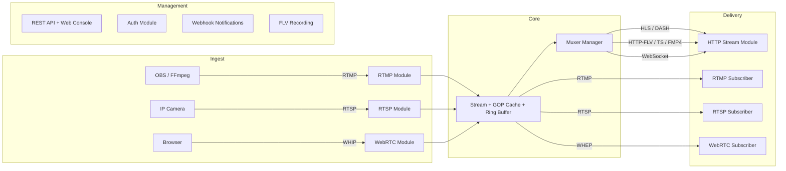

<div align="center">

# LiveForge

**High-performance multi-protocol live streaming server written in Go**

[](https://go.dev)
[](LICENSE)
[](#testing)

[English](README.md) | [中文](README.zh-CN.md)

</div>

---

LiveForge is a modular live streaming media server that ingests, transmuxes, and delivers audio/video in real time. It supports RTMP, RTSP, WebRTC (WHIP/WHEP), HLS, DASH, HTTP-FLV, FMP4, and WebSocket streaming — all from a single binary with zero external dependencies.

## Features

- **Multi-protocol ingest** — Publish via RTMP, RTSP (TCP + UDP), or WebRTC WHIP from OBS, FFmpeg, GStreamer, or a browser
- **Multi-protocol playback** — Pull via RTMP, RTSP, WebRTC WHEP, HLS, DASH, HTTP-FLV, HTTP-TS, FMP4, or WebSocket
- **WebRTC browser tools** — Built-in console with WHIP publish (camera/mic) and WHEP playback, real-time stats overlay
- **Protocol bridge** — Push RTMP, pull via WebRTC; push WebRTC, pull via HLS — any combination works
- **Codec support** — H.264, H.265/HEVC, VP8, VP9, AV1, AAC, Opus, G.711, MP3, and more
- **GOP cache** — New subscribers receive the latest keyframe group instantly for fast startup
- **Web console** — Real-time dashboard showing streams, bitrate, FPS, GOP cache, subscribers, and preview player
- **REST API** — Full management API: list/inspect/delete streams, kick publishers, server stats, health checks
- **Auth** — JWT token verification and HTTP callback authentication for publish and subscribe
- **Recording** — FLV file recording with duration-based segmentation and path templates
- **Notifications** — HTTP webhook delivery with HMAC-SHA256 signatures and retry backoff
- **Single binary** — `go build` and run. No FFmpeg, no Docker, no runtime dependencies

## Architecture



## Quick Start

### Build and Run

```bash
git clone https://github.com/im-pingo/liveforge.git
cd liveforge
go build -o liveforge ./cmd/liveforge
./liveforge -c configs/liveforge.yaml
```

### Publish a Stream

**RTMP (OBS / FFmpeg):**
```bash
ffmpeg -re -i input.mp4 -c copy -f flv rtmp://localhost:1935/live/stream1
```

**RTSP:**
```bash
ffmpeg -re -i input.mp4 -c copy -f rtsp rtsp://localhost:8554/live/stream1
```

**WebRTC (Browser):**
Open `http://localhost:8090/console`, click **"+ WebRTC Publish"**, select camera/mic, and start streaming.

### Play a Stream

| Protocol | URL |
|----------|-----|
| RTMP | `rtmp://localhost:1935/live/stream1` |
| RTSP | `rtsp://localhost:8554/live/stream1` |
| HLS | `http://localhost:8080/live/stream1.m3u8` |
| DASH | `http://localhost:8080/live/stream1.mpd` |
| HTTP-FLV | `http://localhost:8080/live/stream1.flv` |
| HTTP-TS | `http://localhost:8080/live/stream1.ts` |
| FMP4 | `http://localhost:8080/live/stream1.mp4` |
| WebRTC | Open console → Preview → WebRTC tab |

### Web Console

Open `http://localhost:8090/console` for the real-time management dashboard:

- Live stream list with state, codecs, bitrate, FPS
- GOP cache visualization
- Multi-protocol preview player (HTTP-FLV, WS-FLV, HTTP-TS, FMP4, WebRTC)
- WebRTC publish with camera/mic and outbound stats
- Stream management (kick publisher, delete stream)

## Configuration

LiveForge uses a single YAML configuration file. See [`configs/liveforge.yaml`](configs/liveforge.yaml) for the full reference.

Key sections:

| Section | Purpose |
|---------|---------|
| `rtmp` | RTMP ingest/playback (default `:1935`) |
| `rtsp` | RTSP ingest/playback with TCP + UDP (default `:8554`) |
| `http_stream` | HLS, DASH, HTTP-FLV, HTTP-TS, FMP4, WebSocket (default `:8080`) |
| `webrtc` | WHIP/WHEP with ICE servers and UDP port range (default `:8443`) |
| `api` | REST API and web console (default `:8090`) |
| `auth` | JWT and HTTP callback authentication |
| `record` | FLV recording with segmentation |
| `notify` | HTTP webhook notifications |
| `stream` | GOP cache, ring buffer, idle timeout settings |

Environment variable expansion is supported: `${API_TOKEN}`, `${AUTH_JWT_SECRET}`.

## Project Structure

```
liveforge/
├── cmd/liveforge/       # Entry point
├── config/              # YAML config loader
├── core/                # Server, Stream, EventBus, StreamHub, MuxerManager
├── module/
│   ├── api/             # REST API + web console
│   ├── auth/            # JWT / HTTP callback auth
│   ├── httpstream/      # HLS, DASH, HTTP-FLV, HTTP-TS, FMP4, WebSocket
│   ├── notify/          # HTTP webhook notifications
│   ├── record/          # FLV stream recording
│   ├── rtmp/            # RTMP protocol (handshake, chunks, AMF0)
│   ├── rtsp/            # RTSP protocol (TCP + UDP transport)
│   └── webrtc/          # WebRTC WHIP/WHEP (via pion/webrtc)
├── pkg/
│   ├── avframe/         # Audio/video frame types
│   ├── codec/           # H.264, H.265, AAC, AV1, Opus, MP3 parsers
│   ├── muxer/           # FLV, TS, FMP4 muxers
│   ├── rtp/             # Full RTP/RTCP stack with 12+ codec packetizers
│   ├── sdp/             # SDP parser and builder
│   └── util/            # Lock-free SPMC ring buffer
└── test/integration/    # End-to-end integration tests
```

## Testing

24 test packages, all passing:

```bash
go test ./...
go test -race ./...     # with race detector
go test -cover ./...    # with coverage
```

## Comparison

| Feature | LiveForge | MediaMTX | SRS | Monibuca |
|---------|-----------|----------|-----|----------|
| Language | Go | Go | C++ | Go |
| RTMP | Yes | Yes | Yes | Yes |
| RTSP | Yes (TCP+UDP) | Yes | Yes | Plugin |
| WebRTC WHIP/WHEP | Yes | Yes | Yes | Plugin |
| HLS/DASH | Yes | Yes | Yes | Plugin |
| HTTP-FLV | Yes | No | Yes | Plugin |
| FMP4 streaming | Yes | No | No | No |
| Web console | Yes (built-in) | No | Yes | Yes |
| Browser publish | Yes (WHIP) | No | No | No |
| Auth (JWT + callback) | Yes | Yes | Yes | Plugin |
| Recording | Yes (FLV) | Yes | Yes | Plugin |
| Webhooks | Yes (HMAC-signed) | No | Yes | No |
| Single binary | Yes | Yes | Yes | No |
| License | MIT | MIT | MIT | MIT |

## Documentation

For comprehensive documentation covering all features, configuration, usage scenarios, and troubleshooting:

- **[Wiki (GitHub)](../../wiki)** — Full documentation on GitHub Wiki (English / 中文)
- **[Wiki (English)](docs/wiki.md)** | **[Wiki (中文)](docs/wiki.zh-CN.md)** — Same content in the repository

## Roadmap

- [x] TLS / HTTPS
- [ ] SIP gateway
- [ ] Cluster forwarding and origin pull
- [x] WebSocket notifications
- [ ] Prometheus metrics
- [ ] Simulcast layer selection
- [ ] Admin UI enhancements

## License

[MIT](LICENSE) — Copyright (c) 2026 Pingos
