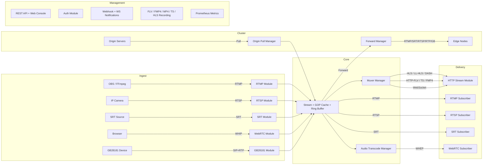

<div align="center">

# LiveForge

**High-performance multi-protocol live streaming server written in Go**

[](https://go.dev)
[](LICENSE)
[](https://github.com/im-pingo/liveforge/actions/workflows/ci.yml)

[English](README.md) | [中文](README.zh-CN.md)

---

**[📖 Wiki Documentation (EN)](../../wiki) | [📖 Wiki 文档 (中文)](../../wiki/Home-zh)**

*Full guides on deployment, configuration, cluster topologies, GB28181, audio transcoding, and more.*

</div>

---

LiveForge is a modular live streaming media server that ingests, transmuxes, and delivers audio/video in real time. It supports RTMP, RTSP, SRT, WebRTC (WHIP/WHEP), HLS, LL-HLS, DASH, HTTP-FLV, FMP4, GB28181, and WebSocket streaming from one server binary. The default build has no native FFmpeg requirement; optional audio transcoding requires the `audiocodec` build tag, CGO, and FFmpeg/libav libraries.

## Highlights

| | Feature | Description |
|-|---------|-------------|
| 🔀 | **Any-to-any protocol bridge** | Push RTMP, pull via WebRTC; push WebRTC, pull via HLS — any combination works |
| 🎵 | **On-demand audio transcoding** | Automatic codec bridging (AAC ↔ Opus ↔ G.711 ↔ MP3) between protocols, powered by FFmpeg/libav |
| 📡 | **GB28181 video surveillance** | Full SIP signaling stack, device registration, live invite, playback, PTZ control, alarm handling — plus a built-in device simulator for testing |
| 🌐 | **Multi-protocol cluster** | Origin-edge cascading via RTMP / SRT / RTSP / RTP / GB28181 with HTTP scheduler callback for dynamic topology |
| ⚡ | **LL-HLS** | Low-Latency HLS with fMP4 partial segments, blocking playlist reload (`_HLS_msn`/`_HLS_part`), and delta playlist updates |
| 🖥️ | **Web console** | Permission-aware tabs for Streams, GB28181, Config, Cluster, SIP Calls, Storage, and Security; Recent Audit is inside Security; grouped as Workspace, Operations, and System so Config/Security are not peer stream pages; includes browser preview/publish |
| 🛡️ | **Production-ready** | Slow consumer protection (EWMA frame dropping), GCC congestion control, per-IP rate limiting, Prometheus metrics |

## Features

### Protocols

- **Multi-protocol ingest** — Publish via RTMP, RTSP (TCP + UDP, separate eligible audio/video SETUP tracks), SRT, WebRTC WHIP, or GB28181
- **Multi-protocol playback** — Pull via RTMP, RTSP, SRT, WebRTC WHEP, HLS, LL-HLS, DASH, HTTP-FLV, HTTP-TS, FMP4, or WebSocket
- **SRT** — Secure Reliable Transport with AES encryption, low-latency MPEG-TS delivery (pure Go via `datarhei/gosrt`)
- **WebRTC** — WHIP/WHEP with a 1 MiB SDP offer limit, ICE Lite, GCC send-side bandwidth estimation, and browser-based publish
- **Codec support** — H.264, H.265/HEVC, VP8, VP9, AV1, AAC, Opus, G.711 (μ-law/A-law), MP3

### Audio Transcoding

LiveForge transparently bridges audio codecs between protocols. When a subscriber requires a different audio codec than the publisher provides, on-demand transcoding kicks in automatically — zero configuration needed.

| Publisher → Subscriber | Codec Path | Use Case |
|----------------------|------------|----------|
| RTMP (AAC) → WebRTC (Opus) | AAC → PCM → Opus | Browser playback of RTMP streams |
| WebRTC (Opus) → RTMP (AAC) | Opus → PCM → AAC | Re-stream browser input to CDN |
| GB28181 (G.711) → HLS (AAC) | G.711 → PCM → AAC | Surveillance camera to web player |
| Any → Any | Decode → Resample → Encode | Full codec matrix supported |

Transcoding is **shared per target codec** — multiple subscribers requesting the same codec share one transcode pipeline. When the publisher's codec matches the subscriber's, frames pass through with zero overhead.

> Requires the `audiocodec` build tag, CGO, and FFmpeg/libav development libraries at build time. See [Wiki: Audio Transcoding](../../wiki/Audio-Transcoding) for build instructions and details.

### GB28181 Video Surveillance

Full GB/T 28181 national standard support for connecting IP cameras and NVRs:

- **SIP signaling** — Device registration, keepalive monitoring, digest authentication
- **Catalog query** — Automatic device and channel discovery
- **Live invite** — Server-initiated INVITE to pull live video from cameras
- **Recording playback** — Time-range playback of device-side recordings
- **PTZ control** — Pan/tilt/zoom and preset commands per GB28181 Annex A
- **Alarm handling** — Receive and process device alarm notifications
- **MPEG-PS demuxing** — RTP/PS stream receiving with H.264 + AAC extraction
- **REST API** — Full device/channel/session management via `/api/v1/gb28181/*`
- **Streams as first-class citizens** — GB28181 streams appear in the stream hub and can be played via any output protocol (HLS, RTMP, WebRTC, etc.)

> See [Wiki: GB28181 Guide](../../wiki/GB28181) for configuration and usage details.

### GB28181 Device Simulator

A built-in simulator (`tools/gb28181-sim`) emulates a GB28181 IPC camera for acceptance testing:

```bash
# Build and run the simulator
go run ./tools/gb28181-sim -server 127.0.0.1:5060 -fps 25

# Customizable: device ID, domain, transport, keepalive, audio toggle
go run ./tools/gb28181-sim \
  -device-id 34020000001110000001 \
  -domain 3402000000 \
  -transport udp \
  -keepalive 30s \
  -no-audio
```

The simulator performs: SIP REGISTER → periodic keepalive → responds to catalog queries → streams RTP/PS (H.264+AAC) on INVITE → handles BYE.

### Cluster

Multi-protocol forwarding and on-demand origin pull for building CDN-like topologies:

- **Forward (push)** — Automatically push streams to downstream nodes when published
- **Origin pull** — Lazily pull from upstream when a subscriber arrives, with idle timeout
- **Multi-protocol relay** — RTMP, SRT, RTSP, RTP, and GB28181 transports
- **HTTP scheduler** — Dynamic target resolution via external HTTP callback, or static target lists
- **Topologies** — Origin-edge, origin-multi-edge, origin-center-edge (three-tier)
- **Retry & resilience** — Configurable retry count, interval, and backoff
- **Forwarding hot path** — Relay and WHEP readers use independent blocking waits; RTMP push reuses FLV encoding buffers, RTSP interleaving uses vectored writes, and relay byte metrics batch after the first observation to reduce per-frame overhead

> See [Wiki: Cluster Deployment](../../wiki/Cluster-Deployment) for topology examples and configuration.

For focused forwarding measurements, run `go test -bench='BenchmarkRingReader|BenchmarkRTMPConn' -benchmem ./pkg/util ./module/cluster`. Benchmark values depend on the host and are not capacity guarantees.

### LL-HLS (Low-Latency HLS)

Apple LL-HLS implementation for sub-second latency HLS delivery:

- **Partial segments** — Configurable part duration (default 200ms) for fine-grained delivery
- **Blocking playlist reload** — `_HLS_msn` and `_HLS_part` query parameters for server-push style updates
- **Delta playlist** — `_HLS_skip=YES` support to reduce playlist transfer size
- **fMP4 container** — Default fMP4 with TS fallback option
- **fMP4 fragment parsing** — Complete media segments assembled from multiple `moof`/`mdat` fragments are parsed without dropping earlier fragments
- **fMP4 AAC timing** — Omitted AAC sample rate and channel count are derived from the AudioSpecificConfig; the resolved sample rate is reused as the media timescale so DTS intervals remain stable
- **Legacy player compat** — Graceful degradation for players without LL-HLS support (buffered segment delivery)
- **Keyframe-aligned startup** — Cached and live GOP frames remain continuous; HLS, LL-HLS, and DASH segmenters wait for the current publisher generation's required sequence headers and bind those headers, replay frames, and the live cursor from one startup snapshot. The initial Hls.js manifest waits for one complete segment without duplicating its parts. Its bounded wait covers the configured full-segment target plus one part (10-second floor, 30-second cap), and returns 503 instead of a part-only manifest if no full segment becomes available. Blocking reloads retain the latest completed part identities while consuming new low-latency parts. DASH also starts after one complete segment, uses a one-fragment live delay, and refreshes its MPD within two seconds. HLS, LL-HLS, and DASH manifests escape each stream-key segment, DASH URL attributes are XML-safe, and media-segment routing preserves valid keys at arbitrary path depth

### Management & Operations

- **Web console** — Seven permission-aware tabs with multi-protocol preview and WHIP publish: Streams, GB28181, Config, Cluster, SIP Calls, Storage, and Security. Recent Audit is a surface inside Security, not a separate tab.
- **REST API** — Stream lifecycle, config refresh/status, cluster status, SIP call control, recording/DVR management, security/audit, GB28181, and public health probes
- **Auth and RBAC** — Named viewer/operator/admin API tokens, console sessions, JWT/callback publish/subscribe auth, bounded redacted audit trail
- **Recording and DVR** — FLV, fragmented MP4, MP4, MPEG-TS, and HLS recording; new recordings default to fMP4/`.mp4`; fMP4 declares AAC directly, converts non-AAC source audio such as G.711, Opus, and MP3 to AAC through the optional `audiocodec`/FFmpeg build, and filters audio to keep playable video-only output when that path is unavailable; a stopped transformed recording drains source frames already committed before finalizing; DVR TS similarly normalizes audio unsupported by its target; segmentation, storage health, download/range/inline-play/delete management, zero-byte session protection, and time-shift status
- **Local protocol labs** — SIP and GB28181 pages run one-shot and persistent fake-device checks locally without another platform or device. SIP uses separate H.264 and PCMA/PCMU RTP/RTCP tracks and never mutates a receive-mode source stream. Receive mode waits for the selected publisher generation's required sequence headers before signaling, while known unsupported codecs are rejected immediately. GB28181 publish registers a listening fake device and exercises LiveForge's normal server-initiated live-play and real RTP/RTCP receive path; receive validates H.264 plus G.711A and admits its source subscriber before module-owned PS/RTP/RTCP egress becomes active. Subscriber-limit rejection fails startup synchronously, while a later media-send failure moves the Lab to `failed` and releases signaling and media resources. The dependency-free moving 160x90 test pattern runs at 25 fps with one IDR per second and audible 20 ms audio frames. Persistent GB28181 sessions renew Keepalive at roughly one-third of `gb28181.keepalive.timeout`. When both modules share one SIP listener, H.264 plus PCMA/PCMU RTP offers route to SIP Gateway while PS/90000 offers route to GB28181
- **SIP RTP port ownership** — Gateway media pairs skip externally occupied ports and remain socket-bound throughout SDP negotiation; fake Lab endpoints avoid the configured gateway RTP range
- **SIP outbound retirement** — Requested PCMA/PCMU conversion uses an independent publisher-generation-bound audio reader. Ready transformed frames are rechecked immediately before RTP send; publisher retirement releases the transcode reader, subscriber, and bound sockets, reclaims the RTP/RTCP pair, and emits one BYE even when another teardown arrives concurrently
- **Protocol Lab stream keys** — SIP and GB28181 accept printable ASCII keys up to 256 bytes whose slash-separated segments are non-empty and are neither `.` nor `..`. GB28181 publish uses that requested key only for the loopback simulator; real devices retain `{stream_prefix}/{channel_id}`
- **GB28181 PS compatibility** — Outbound PS converts internal AVCC/HVCC video samples to Annex-B so real GB28181 receivers can decode video
- **Lab diagnostics** — Managers retain all active sessions plus the newest 16 terminal records. Failed sessions expose a bounded `last_error` with SIP credentials and bearer tokens removed; session views expose receiver-side RTCP and separate audio/video counters. Playback paths escape each stream-key segment and use actual bound listeners for absolute RTMP/RTSP URLs; Console Lab Preview consumes those returned paths directly
- **Startup rollback** — Listener or module initialization failures report the original error, close only modules whose initialization was attempted, and do not panic while rolling back later uninitialized modules
- **Notifications** — HTTP webhook (HMAC-SHA256 signed) and WebSocket real-time events
- **Prometheus metrics** — Server-level and per-stream gauges: connections, bitrate, FPS, GOP cache, subscribers by protocol
- **Rate limiting** — Per-IP token bucket for connection flood protection
- **Slow consumer protection** — EWMA-based lag detection with progressive frame dropping
- **GCC congestion control** — Send-side bandwidth estimation for WebRTC WHEP with adaptive bitrate pacing
- **Generation-bound startup** — SIP, GB28181, recording, DVR, and cluster egress capture one publisher snapshot, replay only the required current headers/GOP once, then continue from its live cursor. SIP inbound INVITEs run synchronous publish authorization before RTP allocation and emit matching start/stop lifecycle events after activation, so recording and DVR follow the call. Publisher replacement cancels old readers, pure-audio streams never replay retained history, and sequence-header-only recordings are failed rather than published as successful media

## Architecture


```mermaid
graph LR
    subgraph Ingest
        OBS[OBS / FFmpeg] -->|RTMP| RTMP_MOD[RTMP Module]
        CAM[IP Camera] -->|RTSP| RTSP_MOD[RTSP Module]
        SRT_PUB[SRT Source] -->|SRT| SRT_MOD[SRT Module]
        BROWSER_PUB[Browser] -->|WHIP| WEBRTC_MOD[WebRTC Module]
        GB_DEV[GB28181 Device] -->|SIP+RTP| GB_MOD[GB28181 Module]
    end

    subgraph Core
        RTMP_MOD --> STREAM[Stream + GOP Cache + Ring Buffer]
        RTSP_MOD --> STREAM
        SRT_MOD --> STREAM
        WEBRTC_MOD --> STREAM
        GB_MOD --> STREAM
        STREAM --> TRANSCODE[Audio Transcode Manager]
        STREAM --> MUXER[Muxer Manager]
    end

    subgraph Delivery
        MUXER -->|HLS / LL-HLS / DASH| HTTP_MOD[HTTP Stream Module]
        MUXER -->|HTTP-FLV / TS / FMP4| HTTP_MOD
        MUXER -->|WebSocket| HTTP_MOD
        STREAM -->|RTMP| RTMP_SUB[RTMP Subscriber]
        STREAM -->|RTSP| RTSP_SUB[RTSP Subscriber]
        STREAM -->|SRT| SRT_SUB[SRT Subscriber]
        TRANSCODE -->|WHEP| WEBRTC_SUB[WebRTC Subscriber]
    end

    subgraph Cluster
        STREAM -->|Forward| FWD[Forward Manager]
        FWD -->|RTMP/SRT/RTSP/RTP/GB| EDGE[Edge Nodes]
        ORIGIN[Origin Servers] -->|Pull| OPL[Origin Pull Manager]
        OPL --> STREAM
    end

    subgraph Management
        API[REST API + Web Console]
        AUTH[Auth Module]
        NOTIFY[Webhook + WS Notifications]
        RECORD[FLV / FMP4 / MP4 / TS / HLS Recording]
        METRICS[Prometheus Metrics]
    end
```

## Quick Start

### Docker (released image)

The release workflow publishes versioned images to `ghcr.io/im-pingo/liveforge` after a `v*` tag completes. Make the GHCR package Public for anonymous pulls, or authenticate with `docker login ghcr.io`. Use a concrete version rather than `latest`. Before the first release, use the local Compose build in [`docs/recipes/docker-local.md`](docs/recipes/docker-local.md).

```bash
docker run -d --name liveforge \
  -p 1935:1935 -p 8554:8554 -p 8080:8080 -p 8443:8443 \
  -p 6000:6000 -p 5060:5060/udp -p 8090:8090 \
  ghcr.io/im-pingo/liveforge:vX.Y.Z
```

Or with docker compose:

```bash
git clone https://github.com/im-pingo/liveforge.git
cd liveforge
docker compose up -d
```

Open `http://localhost:8090/console` to access the web console.

To use a custom config:

```bash
docker run -d --name liveforge \
  -v /path/to/liveforge.yaml:/etc/liveforge/liveforge.yaml:ro \
  -p 1935:1935 -p 8554:8554 -p 8080:8080 -p 8443:8443 \
  -p 6000:6000 -p 5060:5060/udp -p 8090:8090 \
  ghcr.io/im-pingo/liveforge:vX.Y.Z
```

### Build from Source

```bash
git clone https://github.com/im-pingo/liveforge.git
cd liveforge
go build -o liveforge ./cmd/liveforge
./liveforge -c configs/liveforge.yaml
```

> To enable audio transcoding, build with CGO and FFmpeg/libav:
> ```bash
> CGO_ENABLED=1 go build -tags audiocodec -o liveforge ./cmd/liveforge
> ```

### Publish a Stream

**RTMP (OBS / FFmpeg):**
```bash
ffmpeg -re -i input.mp4 -c copy -f flv rtmp://localhost:1935/live/stream1
```

**RTSP:**
```bash
ffmpeg -re -i input.mp4 -c copy -f rtsp rtsp://localhost:8554/live/stream1
```

**SRT:**
```bash
ffmpeg -re -i input.mp4 -c copy -f mpegts "srt://localhost:6000?streamid=publish:/live/stream1"
```

**WebRTC (Browser):**
Open `http://localhost:8090/console`, click **"+ WebRTC Publish"**, select camera/mic, and start streaming.

The Console can publish H.265/HEVC video with Opus audio when the browser and platform expose an H.265 WebRTC encoder. WHIP maps audio and video RTP onto one session timeline, and HLS/DASH/FLV/TS use a combined transcode reader from the cached GOP source position so target audio history and live source video continue without a first-frame freeze or duplicate cached video. Its FMP4 preview preserves signed B-frame composition offsets on a near-zero timeline established when the shared muxer starts; later subscribers seek to their first buffered timestamp. WHEP Live replays the atomic cached GOP while source video continues from the matching ring cursor, with transcoded target audio read independently. The WebRTC transcode worker waits without consuming the source playback wakeup, so video pacing remains stable even when source audio pauses. The tagged audio build is the complete cross-protocol profile; see [WHIP H.265 + Opus playback verification](docs/recipes/whip-h265-opus-playback.md).

Known review issue: the Console's default realtime WHEP preview can report `No advancing media received (check codec support and keyframes)` while it waits for the next H.264 keyframe after `LiveCursor`; a long GOP can outlast the 8-second watchdog. WHEP Live and the current H.264 browser path decode successfully, but the default behavior, write-error diagnostics, and real GB28181/SIP H.264 browser coverage remain open. See [the technical risk record](docs/TECHNICAL-RISKS.md); SDP success or an `ontrack` callback alone is not proof of playback.

**GB28181:**
Configure your IP camera's SIP server to point at `localhost:5060`, or use the built-in simulator:
```bash
go run ./tools/gb28181-sim -server 127.0.0.1:5060
```

### Play a Stream

| Protocol | URL |
|----------|-----|
| RTMP | `rtmp://localhost:1935/live/stream1` |
| RTSP | `rtsp://localhost:8554/live/stream1` |
| SRT | `srt://localhost:6000?streamid=subscribe:/live/stream1` |
| HLS | `http://localhost:8080/live/stream1.m3u8` |
| LL-HLS | `http://localhost:8080/live/stream1.m3u8` (auto when enabled) |
| DASH | `http://localhost:8080/live/stream1.mpd` |
| HTTP-FLV | `http://localhost:8080/live/stream1.flv` |
| HTTP-TS | `http://localhost:8080/live/stream1.ts` |
| FMP4 | `http://localhost:8080/live/stream1.mp4` |
| WebRTC | Open console → Preview → WebRTC tab |

Pure-audio AAC publishers produce completed HLS, DASH, and LL-HLS segments while
the source is still live. For stream key `live/audio`, inspect the HLS or LL-HLS
playlist at `/live/audio.m3u8` and a full segment at `/live/audio/0.ts` or
`/live/audio/0.m4s`; inspect DASH at `/live/audio.mpd`, with audio init
`/live/audio/audio_init.mp4` and media `/live/audio/a1.m4s`. LL-HLS
`part_duration` controls partial segments, while `segment_duration` controls
completed full segments and defaults to `1.0` seconds. Without video keyframes,
the first full segment completes near the configured segment target instead of
waiting for source shutdown. DASH media fragments retain one continuous relative
decode timeline even when the publisher's first DTS is zero.

### Web Console

Open `http://localhost:8090/console` for the real-time management dashboard. Preview URLs use the active HTTP/WebRTC listener reported by the server. If another process (for example nginx or a local helper) owns `127.0.0.1:8080`, RTMP and WHEP can work while HTTP-FLV/HLS/DASH/FMP4 preview requests receive that process's 404; release the port or set `http_stream.listen` to an unused address.

The tabs, in order, are Streams, GB28181, Config, Cluster, SIP Calls, Storage, and Security. Recent Audit is a surface inside Security, not a separate tab. The visual groups are Workspace (Streams, GB28181, SIP Calls, Storage), Operations (Cluster), and System (Config, Security). When the API listener uses TLS, console login issues the HttpOnly, SameSite=Strict `lf_session` cookie with `Secure`; the local plain-HTTP listener leaves `Secure` unset.

- Live stream list with state, codecs, bitrate, FPS
- GOP Cache visualization with keyframe-driven generation, interleaved video/audio frame counts, and duration; audio-only streams show `Not applicable (audio-only)`
- Multi-protocol preview player (HTTP-FLV, WS-FLV, HTTP-TS, FMP4, HLS, DASH, WebRTC realtime, and WebRTC Live)
- WebRTC publish with camera/mic and outbound stats
- Permission-aware stream kick/delete and runtime config refresh
- Cluster relay/peer status and SIP call dial/detail/hangup
- Recording metadata/download/inline-play/delete, DVR session/storage status and online HLS preview, security posture, and bounded audit events
- WHEP preview starts asynchronously received media muted when browser autoplay policy requires it and exposes an Unmute/Mute control without dropping the audio track
- Complete redacted Config document/schema display, read-only Validate, source-aware Apply & Refresh, and writable/read-only status for file, HTTP/HTTPS, Consul, and Redis
- SIP and GB28181 local protocol Test Lab results, including unavailable-module states; both provider sessions can publish or receive persistent H.264 plus G.711 loopback media, show per-track RTP/RTCP/PS counters, stop cleanly, and preview through the available output protocols

DVR playlist and segment GETs run synchronous subscribe authorization hooks only; they do not emit asynchronous subscribe lifecycle events.
Recording preview uses the authenticated management API session. DVR preview uses the separate `dvr.listen` HLS listener with non-credentialed CORS, so its subscribe authorization still applies; the Console does not persist or append bearer tokens.

## Configuration

LiveForge uses a bootstrap YAML configuration plus an optional runtime source. See [`configs/liveforge.yaml`](configs/liveforge.yaml) for the full reference. The Config page displays the complete redacted effective/desired document and schema, validates candidates, and applies them through file, HTTP/HTTPS, Consul, or Redis when the source is writable; read-only sources return 409. See [`docs/recipes/runtime-config-sources.md`](docs/recipes/runtime-config-sources.md).

The checked-in sample is for local development only: it disables TLS and authentication and uses `admin/admin`. Never expose it publicly unchanged.

Key sections:

| Section | Purpose |
|---------|---------|
| `rtmp` | RTMP ingest/playback (default `:1935`) |
| `rtsp` | RTSP ingest/playback with TCP + UDP (default `:8554`) |
| `http_stream` | HLS, LL-HLS, DASH, HTTP-FLV, HTTP-TS, FMP4, WebSocket (default `:8080`); `http_stream.llhls.segment_duration` controls completed LL-HLS segments |
| `webrtc` | WHIP/WHEP with ICE servers and UDP port range (default `:8443`) |
| `srt` | SRT ingest/playback with AES encryption (default `:6000`) |
| `sip` | SIP signaling server and local SIP Gateway lab (default `:5060`) |
| `gb28181` | GB28181 device management, RTP port range, keepalive, auto-invite |
| `audio_codec` | Enable/disable on-demand audio transcoding |
| `api` | REST API and web console (default `:8090`) |
| `auth` | JWT and HTTP callback authentication |
| `record` | FLV/FMP4/MP4/TS/HLS recording, segmentation, completion callback |
| `dvr` | Time-shift segments, retention window, storage and session status |
| `notify` | HTTP webhook and WebSocket notifications |
| `cluster` | Multi-protocol forwarding and origin pull with scheduler |
| `metrics` | Prometheus metrics endpoint (default `:9090`) |
| `limits` | Global connection, stream, and subscriber limits |
| `tls` | TLS certificate and key for HTTPS/secure protocols |
| `stream` | GOP cache, ring buffer, idle timeout, slow consumer, feedback; Simulcast fields are deferred |
| `runtime` | Background configuration refresh source: file, HTTP/HTTPS, Consul, or Redis |

Environment variable expansion is supported: `${API_TOKEN}`, `${AUTH_JWT_SECRET}`.

### Runtime configuration refresh

The bootstrap file is loaded once. A background manager then polls the selected `runtime.source` and atomically publishes validated snapshots. Application reads use the in-memory snapshot only, so they never block on file or network I/O. Source loads, Config Apply writes, and source close are serialized; Apply waits for the source write before returning 202 and schedules parsing/application/publication asynchronously. The Config page shows the complete versioned JSON Schema and retains raw desired source YAML, including comments and fields not represented by the typed runtime struct. Source failures retain the last valid snapshot. For HTTP sources, the selected `http` or `https` source must match the URL scheme, redirects are disabled, and ETag/Last-Modified validators advance only after a document is accepted; `X-Config-Version` is separate version metadata. `SIGHUP` and `POST /api/v1/server/config/refresh` schedule asynchronous refresh; listener/module/TLS/port changes are reported as restart-required and are not partially applied. Status and Prometheus expose accepted, rejected, application-failed, callback-failed, coalesced callback, and pending-restart state. See [`docs/recipes/runtime-config-sources.md`](docs/recipes/runtime-config-sources.md) for file, HTTP, HTTPS, Consul, Redis, Config Validate, and Config Apply examples.

Operators can inspect the redacted loader state at `GET /api/v1/server/config` (protected by the normal API authentication rules).

## Testing Tools

### lf-test CLI

A comprehensive integration testing tool (`tools/lf-test`) for validating all server features:

```bash
# Push test (supports: rtmp, rtsp, srt, whip, gb28181)
go run ./tools/lf-test push --protocol rtmp --target rtmp://localhost:1935/live/test --realtime

# Play test (supports: rtmp, rtsp, srt, whep, httpflv, wsflv, hls, llhls, dash)
go run ./tools/lf-test play --protocol hls --url http://localhost:8080/live/test.m3u8

# Cluster topology test (auto-launches multi-node cluster)
go run ./tools/lf-test cluster \
  --topology origin-edge \
  --relay-protocol srt \
  --push-protocol rtmp \
  --play-protocol hls

# Auth test
go run ./tools/lf-test auth --target rtmp://localhost:1935/live/test --token <jwt>
```

All commands support `--assert` expressions and `--output json` for CI integration.

### gb28181-sim

See [GB28181 Device Simulator](#gb28181-device-simulator) above.

## Project Structure

```
liveforge/
├── cmd/liveforge/       # Entry point
├── config/              # YAML config loader
├── core/                # Server, Stream, EventBus, StreamHub, MuxerManager, TranscodeManager
├── module/
│   ├── api/             # REST API + web console
│   ├── auth/            # JWT / HTTP callback auth
│   ├── cluster/         # Multi-protocol forwarding + origin pull (RTMP/SRT/RTSP/RTP/GB28181)
│   ├── gb28181/         # GB28181 protocol (SIP signaling, device registry, invite, PTZ, playback, alarm)
│   ├── httpstream/      # HLS, LL-HLS, DASH, HTTP-FLV, HTTP-TS, FMP4, WebSocket
│   ├── metrics/         # Prometheus metrics endpoint
│   ├── notify/          # HTTP webhook + WebSocket notifications
│   ├── dvr/             # Time-shift segment storage and playback
│   ├── record/          # FLV/FMP4/MP4/TS/HLS recording and storage management
│   ├── rtmp/            # RTMP protocol (handshake, chunks, AMF0)
│   ├── rtsp/            # RTSP protocol (TCP + UDP transport)
│   ├── sip/             # SIP transport layer (used by GB28181)
│   ├── sipgateway/      # Inbound/outbound SIP media gateway and call control
│   ├── srt/             # SRT protocol (via datarhei/gosrt)
│   └── webrtc/          # WebRTC WHIP/WHEP + GCC (via pion/webrtc)
├── pkg/
│   ├── audiocodec/      # Audio transcode: FFmpeg-backed decode/encode/resample (AAC, Opus, G.711, MP3)
│   ├── avframe/         # Audio/video frame types
│   ├── codec/           # H.264, H.265, AAC, AV1, Opus, MP3 parsers
│   ├── logger/          # Structured logging
│   ├── muxer/           # FLV, TS, FMP4, MPEG-PS muxers and demuxers
│   ├── portalloc/       # Port range allocator for RTP
│   ├── ratelimit/       # Per-IP token bucket rate limiter
│   ├── rtp/             # Full RTP/RTCP stack with 12+ codec packetizers
│   ├── sdp/             # SDP parser and builder
│   └── util/            # Lock-free SPMC ring buffer
├── tools/
│   ├── gb28181-sim/     # GB28181 device simulator
│   ├── lf-test/         # Integration test CLI (push, play, auth, cluster)
│   └── testkit/         # Reusable test components (push, play, cluster, analyzer, report)
└── test/integration/    # End-to-end integration tests
```

## Testing

The repository has a quick package check and a complete FFmpeg-backed test suite:

```bash
go test ./...
CGO_ENABLED=1 go test -tags audiocodec -race -coverprofile=coverage.out -covermode=atomic ./...
```

The first command skips FFmpeg-tagged transcoding integration tests. The second command is the complete suite and requires Go 1.26 and FFmpeg development libraries.

## Comparison

| Feature | LiveForge | MediaMTX | SRS | Monibuca |
|---------|-----------|----------|-----|----------|
| Language | Go | Go | C++ | Go |
| RTMP | Yes | Yes | Yes | Yes |
| RTSP | Yes (TCP+UDP) | Yes | Yes | Plugin |
| SRT | Yes (pure Go) | Yes | Yes | Plugin |
| WebRTC WHIP/WHEP | Yes | Yes | Yes | Plugin |
| HLS/DASH | Yes | Yes | Yes | Plugin |
| LL-HLS | Yes (fMP4 + blocking reload) | No | Yes | No |
| HTTP-FLV | Yes | No | Yes | Plugin |
| FMP4 streaming | Yes | No | No | No |
| GB28181 | Yes (full SIP + live/playback/PTZ) | No | Yes | Plugin |
| Audio transcoding | Yes (AAC↔Opus↔G.711↔MP3) | No | Yes | Plugin |
| Cluster relay | Yes (RTMP/SRT/RTSP/RTP/GB28181) | No | Yes | Plugin |
| Web console | Yes (built-in) | No | Yes | Yes |
| Browser publish | Yes (WHIP) | No | No | No |
| Auth (JWT + callback) | Yes | Yes | Yes | Plugin |
| Recording | Yes (FLV/FMP4/MP4/TS/HLS) | Yes | Yes | Plugin |
| Webhooks | Yes (HMAC-signed) | No | Yes | No |
| ICE Lite | Yes | No | No | No |
| Prometheus metrics | Yes | No | Yes | Plugin |
| GCC congestion control | Yes | No | No | No |
| Testing tools | Yes (lf-test CLI + GB28181 sim) | No | No | No |
| Single binary | Yes | Yes | Yes | No |
| License | MIT | MIT | MIT | MIT |

## Documentation

> **📖 Full documentation is on the [GitHub Wiki](../../wiki).**

For coding agents, start with [`AGENTS.md`](AGENTS.md), [`agent-manifest.json`](agent-manifest.json), and [`llms.txt`](llms.txt). The API contract, configuration schema, and runnable recipes are kept in `docs/` and checked by CI.

Operational recipes: [runtime config](docs/recipes/runtime-config-sources.md), [authentication/TLS](docs/recipes/auth-and-tls.md), [recording/DVR](docs/recipes/recording-dvr-management.md), [SIP Gateway](docs/recipes/sipgateway-management.md), [SIP/GB28181 protocol test lab](docs/recipes/protocol-test-lab.md), [cluster relay](docs/recipes/cluster-relay-operations.md), [RBAC/audit](docs/recipes/rbac-audit.md), and [release verification](docs/recipes/release-verification.md).

| Topic | EN | 中文 |
|-------|-----|------|
| Home | [Wiki Home](../../wiki) | [Wiki 首页](../../wiki/Home-zh) |
| Audio Transcoding | [Audio Transcoding](../../wiki/Audio-Transcoding) | [音频转码](../../wiki/Audio-Transcoding-zh) |
| GB28181 Guide | [GB28181](../../wiki/GB28181) | [GB28181 指南](../../wiki/GB28181-zh) |
| Cluster Deployment | [Cluster Deployment](../../wiki/Cluster-Deployment) | [集群部署](../../wiki/Cluster-Deployment-zh) |
| LL-HLS | [LL-HLS](../../wiki/LLHLS) | [低延迟 HLS](../../wiki/LLHLS-zh) |
| Testing Tools | [Testing Tools](../../wiki/Testing-Tools) | [测试工具](../../wiki/Testing-Tools-zh) |
| Configuration Reference | [Configuration](../../wiki/Configuration) | [配置参考](../../wiki/Configuration-zh) |
| REST API | [REST API](../../wiki/REST-API) | [REST API](../../wiki/REST-API-zh) |

## Roadmap

- [x] TLS / HTTPS
- [x] SRT protocol
- [x] Multi-protocol cluster relay (RTMP, SRT, RTSP, RTP, GB28181)
- [x] WebRTC ICE Lite
- [x] WebSocket notifications
- [x] Prometheus metrics
- [x] LL-HLS (partial segments + blocking reload)
- [x] Slow consumer protection (EWMA frame dropping)
- [x] GCC congestion control for WebRTC
- [x] Rate limiting
- [x] GB28181 (SIP + live + playback + PTZ + alarm)
- [x] Audio transcoding (AAC, Opus, G.711, MP3)
- [x] SIP gateway
- [x] Permission-aware seven-view management console
- [x] Recording/DVR, cluster, security, and audit management APIs, including Storage online preview
- [ ] Simulcast layer selection

## License

[MIT](LICENSE) — Copyright (c) 2026 Pingos
