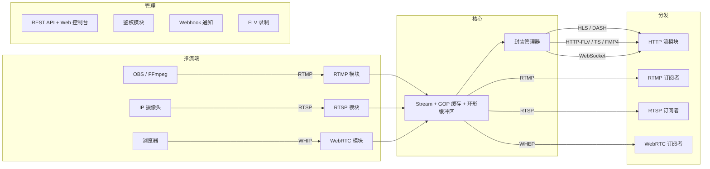

<div align="center">

# LiveForge

**Go 语言编写的高性能多协议直播流媒体服务器**

[](https://go.dev)
[](LICENSE)
[](#测试)

[English](README.md) | [中文](README.zh-CN.md)

</div>

---

LiveForge 是一个模块化的直播流媒体服务器，支持实时音视频的接入、转封装和分发。支持 RTMP、RTSP、WebRTC（WHIP/WHEP）、HLS、DASH、HTTP-FLV、FMP4 和 WebSocket 推拉流 —— 单一可执行文件，零外部依赖。

## 特性

- **多协议推流** — 支持 RTMP、RTSP（TCP + UDP）、WebRTC WHIP 推流，兼容 OBS、FFmpeg、GStreamer 及浏览器
- **多协议拉流** — 支持 RTMP、RTSP、WebRTC WHEP、HLS、LL-HLS、DASH、HTTP-FLV、HTTP-TS、FMP4、WebSocket 播放
- **浏览器推拉流** — 内置 Web 控制台支持 WHIP 推流（摄像头/麦克风）和 WHEP 播放，实时统计覆盖层
- **协议桥接** — RTMP 推流可用 WebRTC 拉取，WebRTC 推流可用 HLS 播放，任意协议组合互通
- **编解码支持** — H.264、H.265/HEVC、VP8、VP9、AV1、AAC、Opus、G.711、MP3 等
- **GOP 缓存** — 新订阅者即时收到最新关键帧组，实现快速起播
- **Web 控制台** — 实时仪表盘展示流列表、码率、帧率、GOP 缓存、订阅者信息和预览播放器
- **REST API** — 完整管理接口：流列表/详情/删除、踢出推流者、服务器状态、健康检查
- **鉴权** — JWT Token 验证和 HTTP 回调鉴权，支持推流和拉流分别控制
- **录制** — FLV 文件录制，支持按时长分段和路径模板
- **通知** — HTTP Webhook 通知，HMAC-SHA256 签名，失败自动重试
- **单文件部署** — `go build` 即可运行，不依赖 FFmpeg、Docker 或其他运行时

## 架构



## 快速开始

### 编译运行

```bash
git clone https://github.com/im-pingo/liveforge.git
cd liveforge
go build -o liveforge ./cmd/liveforge
./liveforge -c configs/liveforge.yaml
```

### 推流

**RTMP（OBS / FFmpeg）：**
```bash
ffmpeg -re -i input.mp4 -c copy -f flv rtmp://localhost:1935/live/stream1
```

**RTSP：**
```bash
ffmpeg -re -i input.mp4 -c copy -f rtsp rtsp://localhost:8554/live/stream1
```

**WebRTC（浏览器）：**
打开 `http://localhost:8090/console`，点击 **"+ WebRTC Publish"**，选择摄像头/麦克风后开始推流。

### 拉流

| 协议 | 地址 |
|------|------|
| RTMP | `rtmp://localhost:1935/live/stream1` |
| RTSP | `rtsp://localhost:8554/live/stream1` |
| HLS | `http://localhost:8080/live/stream1.m3u8` |
| DASH | `http://localhost:8080/live/stream1.mpd` |
| HTTP-FLV | `http://localhost:8080/live/stream1.flv` |
| HTTP-TS | `http://localhost:8080/live/stream1.ts` |
| FMP4 | `http://localhost:8080/live/stream1.mp4` |
| WebRTC | 打开控制台 → 点击 Preview → 选择 WebRTC 标签页 |

### Web 控制台

访问 `http://localhost:8090/console` 打开实时管理仪表盘：

- 流列表：状态、编解码器、码率、帧率
- GOP 缓存可视化
- 多协议预览播放器（HTTP-FLV、WS-FLV、HTTP-TS、FMP4、WebRTC）
- WebRTC 推流（摄像头/麦克风 + 发送端统计）
- 流管理（踢出推流者、删除流）

## 配置

LiveForge 使用单个 YAML 配置文件。完整参考见 [`configs/liveforge.yaml`](configs/liveforge.yaml)。

主要配置段：

| 配置段 | 功能 |
|--------|------|
| `rtmp` | RTMP 推拉流（默认 `:1935`） |
| `rtsp` | RTSP 推拉流，TCP + UDP（默认 `:8554`） |
| `http_stream` | HLS、DASH、HTTP-FLV、HTTP-TS、FMP4、WebSocket（默认 `:8080`） |
| `webrtc` | WHIP/WHEP，ICE 服务器和 UDP 端口范围（默认 `:8443`） |
| `api` | REST API 和 Web 控制台（默认 `:8090`） |
| `auth` | JWT 和 HTTP 回调鉴权 |
| `record` | FLV 录制及分段 |
| `notify` | HTTP Webhook 通知 |
| `stream` | GOP 缓存、环形缓冲区、空闲超时设置 |

支持环境变量展开：`${API_TOKEN}`、`${AUTH_JWT_SECRET}`。

## 项目结构

```
liveforge/
├── cmd/liveforge/       # 程序入口
├── config/              # YAML 配置加载
├── core/                # Server、Stream、EventBus、StreamHub、MuxerManager
├── module/
│   ├── api/             # REST API + Web 控制台
│   ├── auth/            # JWT / HTTP 回调鉴权
│   ├── httpstream/      # HLS、DASH、HTTP-FLV、HTTP-TS、FMP4、WebSocket
│   ├── notify/          # HTTP Webhook 通知
│   ├── record/          # FLV 流录制
│   ├── rtmp/            # RTMP 协议（握手、分块、AMF0）
│   ├── rtsp/            # RTSP 协议（TCP + UDP 传输）
│   └── webrtc/          # WebRTC WHIP/WHEP（基于 pion/webrtc）
├── pkg/
│   ├── avframe/         # 音视频帧类型定义
│   ├── codec/           # H.264、H.265、AAC、AV1、Opus、MP3 解析器
│   ├── muxer/           # FLV、TS、FMP4 封装器
│   ├── rtp/             # 完整 RTP/RTCP 协议栈，12+ 编解码器打包器
│   ├── sdp/             # SDP 解析器和构建器
│   └── util/            # 无锁 SPMC 环形缓冲区
└── test/integration/    # 端到端集成测试
```

## 测试

24 个测试包，全部通过：

```bash
go test ./...
go test -race ./...     # 开启竞态检测
go test -cover ./...    # 查看覆盖率
```

## 对比

| 特性 | LiveForge | MediaMTX | SRS | Monibuca |
|------|-----------|----------|-----|----------|
| 语言 | Go | Go | C++ | Go |
| RTMP | 支持 | 支持 | 支持 | 支持 |
| RTSP | 支持（TCP+UDP） | 支持 | 支持 | 插件 |
| WebRTC WHIP/WHEP | 支持 | 支持 | 支持 | 插件 |
| HLS/DASH | 支持 | 支持 | 支持 | 插件 |
| HTTP-FLV | 支持 | 不支持 | 支持 | 插件 |
| FMP4 流式传输 | 支持 | 不支持 | 不支持 | 不支持 |
| Web 控制台 | 内置 | 无 | 有 | 有 |
| 浏览器推流 | 支持（WHIP） | 不支持 | 不支持 | 不支持 |
| 鉴权（JWT + 回调） | 支持 | 支持 | 支持 | 插件 |
| 录制 | 支持（FLV） | 支持 | 支持 | 插件 |
| Webhook 通知 | 支持（HMAC 签名） | 不支持 | 支持 | 不支持 |
| 单文件部署 | 是 | 是 | 是 | 否 |
| 许可证 | MIT | MIT | MIT | MIT |

## 文档

完整文档涵盖所有功能、配置、使用场景和故障排查：

- **[Wiki (GitHub)](../../wiki)** — GitHub Wiki 完整文档（English / 中文）
- **[Wiki (English)](docs/wiki.md)** | **[Wiki (中文)](docs/wiki.zh-CN.md)** — 仓库内同步文档

## 路线图

- [x] TLS / HTTPS 支持
- [ ] SIP 网关
- [ ] 集群转发和回源
- [x] WebSocket 通知
- [ ] Prometheus 指标
- [ ] Simulcast 分层选择
- [ ] 管理后台增强

## 许可证

[MIT](LICENSE) — Copyright (c) 2026 Pingos
