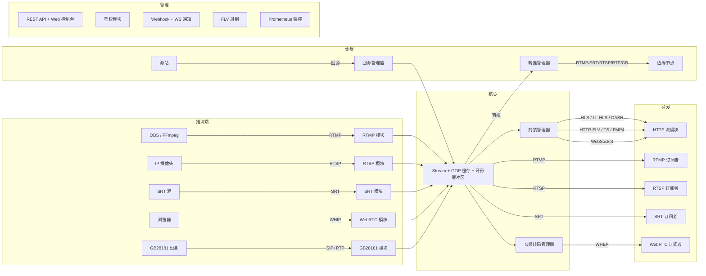

<div align="center">

# LiveForge

**Go 语言编写的高性能多协议直播流媒体服务器**

[](https://go.dev)
[](LICENSE)
[](#测试)

[English](README.md) | [中文](README.zh-CN.md)

---

**[📖 Wiki 文档 (中文)](../../wiki/Home-zh) | [📖 Wiki Documentation (EN)](../../wiki)**

*完整的部署指南、配置说明、集群拓扑、GB28181、音频转码等详细文档。*

</div>

---

LiveForge 是一个模块化的直播流媒体服务器，支持实时音视频的接入、转封装和分发。支持 RTMP、RTSP、SRT、WebRTC（WHIP/WHEP）、HLS、LL-HLS、DASH、HTTP-FLV、FMP4、GB28181 和 WebSocket 推拉流 —— 单一可执行文件，零外部依赖。

## 亮点

| | 特性 | 说明 |
|-|------|------|
| 🔀 | **任意协议互通** | RTMP 推流 WebRTC 拉取，WebRTC 推流 HLS 播放 —— 任意组合即开即用 |
| 🎵 | **按需音频转码** | 跨协议自动桥接音频编解码（AAC ↔ Opus ↔ G.711 ↔ MP3），基于 FFmpeg/libav |
| 📡 | **GB28181 视频监控** | 完整 SIP 信令栈，设备注册、实时拉流、录像回放、云台控制、报警处理 —— 附带内置设备模拟器 |
| 🌐 | **多协议集群** | 支持 RTMP / SRT / RTSP / RTP / GB28181 的 Origin-Edge 级联，支持 HTTP 调度回调动态拓扑 |
| ⚡ | **LL-HLS 低延迟** | fMP4 部分分片、阻塞式播放列表刷新（`_HLS_msn`/`_HLS_part`）、增量播放列表 |
| 🖥️ | **Web 控制台** | 内置实时仪表盘，流统计、多协议预览、浏览器 WHIP 推流 |
| 🛡️ | **生产级可靠性** | 慢消费者保护（EWMA 丢帧）、GCC 拥塞控制、IP 级限流、Prometheus 监控 |

## 特性

### 协议支持

- **多协议推流** — RTMP、RTSP（TCP + UDP）、SRT、WebRTC WHIP、GB28181，兼容 OBS、FFmpeg、GStreamer 及浏览器
- **多协议拉流** — RTMP、RTSP、SRT、WebRTC WHEP、HLS、LL-HLS、DASH、HTTP-FLV、HTTP-TS、FMP4、WebSocket
- **SRT** — 安全可靠传输，AES 加密，低延迟 MPEG-TS 传输（纯 Go 实现 `datarhei/gosrt`）
- **WebRTC** — WHIP/WHEP、ICE Lite、GCC 发送端带宽估计、浏览器推流
- **编解码** — H.264、H.265/HEVC、VP8、VP9、AV1、AAC、Opus、G.711（μ-law/A-law）、MP3

### 音频转码

LiveForge 在协议间自动桥接音频编解码器。当订阅者需要的音频编解码与推流者不同时，按需转码自动生效 —— 无需任何配置。

| 推流 → 拉流 | 转码路径 | 典型场景 |
|-------------|----------|----------|
| RTMP (AAC) → WebRTC (Opus) | AAC → PCM → Opus | 浏览器播放 RTMP 流 |
| WebRTC (Opus) → RTMP (AAC) | Opus → PCM → AAC | 浏览器推流转推到 CDN |
| GB28181 (G.711) → HLS (AAC) | G.711 → PCM → AAC | 监控摄像头到 Web 播放 |
| 任意 → 任意 | 解码 → 重采样 → 编码 | 全编解码矩阵支持 |

转码实例**按目标编解码共享** —— 多个请求同一编解码的订阅者共享一个转码管线。当推流和拉流编解码一致时，帧零开销透传。

> 编译时需要 FFmpeg/libav 库（`CGO_ENABLED=1`）。详见 [Wiki: 音频转码](../../wiki/Audio-Transcoding-zh)。

### GB28181 视频监控

完整支持 GB/T 28181 国标协议，接入 IP 摄像头和 NVR：

- **SIP 信令** — 设备注册、心跳检测、Digest 鉴权
- **设备目录查询** — 自动发现设备和通道
- **实时拉流** — 服务端主动 INVITE 拉取摄像头实时画面
- **录像回放** — 按时间范围回放设备端录像
- **云台控制** — 按 GB28181 附录 A 规范发送 PTZ 指令（方向、变焦、预置位）
- **报警处理** — 接收和处理设备报警通知
- **MPEG-PS 解封装** — RTP/PS 流接收，提取 H.264 + AAC
- **REST API** — 完整的设备/通道/会话管理 `/api/v1/gb28181/*`
- **统一流管理** — GB28181 流接入流中心后，可通过任意输出协议播放（HLS、RTMP、WebRTC 等）

> 详见 [Wiki: GB28181 指南](../../wiki/GB28181-zh)。

### GB28181 设备模拟器

内置模拟器（`tools/gb28181-sim`）模拟 GB28181 IPC 摄像头，用于验收测试：

```bash
# 编译运行模拟器
go run ./tools/gb28181-sim -server 127.0.0.1:5060 -fps 25

# 可定制：设备 ID、域、传输协议、心跳间隔、音频开关
go run ./tools/gb28181-sim \
  -device-id 34020000001110000001 \
  -domain 3402000000 \
  -transport udp \
  -keepalive 30s \
  -no-audio
```

模拟器执行流程：SIP REGISTER → 周期性心跳 → 响应目录查询 → 收到 INVITE 后发送 RTP/PS（H.264+AAC）→ 处理 BYE。

### 集群方案

多协议转推和按需回源拉流，构建 CDN 级联拓扑：

- **转推（Forward）** — 推流时自动转推到下游节点
- **回源（Origin Pull）** — 有订阅者时按需从上游拉流，空闲自动断开
- **多协议中继** — RTMP、SRT、RTSP、RTP、GB28181 传输
- **HTTP 调度器** — 通过外部 HTTP 回调动态解析目标节点，或使用静态目标列表
- **拓扑模式** — 单层（Origin-Edge）、多边缘（Origin-Multi-Edge）、三级级联（Origin-Center-Edge）
- **重试与容错** — 可配置重试次数、间隔和退避

> 详见 [Wiki: 集群部署](../../wiki/Cluster-Deployment-zh)。

### LL-HLS（低延迟 HLS）

Apple LL-HLS 标准实现，亚秒级延迟 HLS 分发：

- **部分分片** — 可配置 Part 时长（默认 200ms），细粒度分发
- **阻塞式播放列表刷新** — 支持 `_HLS_msn` 和 `_HLS_part` 查询参数
- **增量播放列表** — 支持 `_HLS_skip=YES` 减少传输量
- **fMP4 容器** — 默认 fMP4，可选 TS 回退
- **兼容旧播放器** — 无 LL-HLS 支持的播放器自动降级为缓冲分片模式

### 管理与运维

- **Web 控制台** — 实时仪表盘：流列表、编解码、码率、帧率、GOP 缓存、多协议预览、浏览器 WHIP 推流
- **REST API** — 流列表/详情/删除、踢出推流者、服务器状态、健康检查
- **鉴权** — JWT Token 验证和 HTTP 回调鉴权，推流/拉流分别控制
- **录制** — FLV 文件录制，按时长分段，路径模板
- **通知** — HTTP Webhook（HMAC-SHA256 签名）和 WebSocket 实时事件
- **Prometheus 监控** — 服务器级和流级指标：连接数、码率、帧率、GOP 缓存、各协议订阅者数
- **限流** — IP 级令牌桶，防止连接洪泛
- **慢消费者保护** — 基于 EWMA 的延迟检测，渐进式丢帧
- **GCC 拥塞控制** — WebRTC WHEP 发送端带宽估计，自适应码率
- **GOP 缓存** — 新订阅者即时收到最新关键帧组，实现快速起播

## 架构



## 快速开始

### Docker 部署（推荐）

```bash
docker run -d --name liveforge \
  -p 1935:1935 -p 8554:8554 -p 8080:8080 -p 8443:8443 \
  -p 6000:6000 -p 5060:5060/udp -p 8090:8090 \
  impingo/liveforge:latest
```

或使用 docker compose：

```bash
git clone https://github.com/im-pingo/liveforge.git
cd liveforge
docker compose up -d
```

打开 `http://localhost:8090/console` 访问 Web 控制台。

使用自定义配置：

```bash
docker run -d --name liveforge \
  -v /path/to/liveforge.yaml:/etc/liveforge/liveforge.yaml:ro \
  -p 1935:1935 -p 8554:8554 -p 8080:8080 -p 8443:8443 \
  -p 6000:6000 -p 5060:5060/udp -p 8090:8090 \
  impingo/liveforge:latest
```

### 源码编译

```bash
git clone https://github.com/im-pingo/liveforge.git
cd liveforge
go build -o liveforge ./cmd/liveforge
./liveforge -c configs/liveforge.yaml
```

> 启用音频转码需带 CGO 和 FFmpeg/libav 编译：
> ```bash
> CGO_ENABLED=1 go build -tags audiocodec -o liveforge ./cmd/liveforge
> ```

### 推流

**RTMP（OBS / FFmpeg）：**
```bash
ffmpeg -re -i input.mp4 -c copy -f flv rtmp://localhost:1935/live/stream1
```

**RTSP：**
```bash
ffmpeg -re -i input.mp4 -c copy -f rtsp rtsp://localhost:8554/live/stream1
```

**SRT：**
```bash
ffmpeg -re -i input.mp4 -c copy -f mpegts "srt://localhost:6000?streamid=publish:/live/stream1"
```

**WebRTC（浏览器）：**
打开 `http://localhost:8090/console`，点击 **"+ WebRTC Publish"**，选择摄像头/麦克风后开始推流。

**GB28181：**
将 IP 摄像头的 SIP 服务器指向 `localhost:5060`，或使用内置模拟器：
```bash
go run ./tools/gb28181-sim -server 127.0.0.1:5060
```

### 拉流

| 协议 | 地址 |
|------|------|
| RTMP | `rtmp://localhost:1935/live/stream1` |
| RTSP | `rtsp://localhost:8554/live/stream1` |
| SRT | `srt://localhost:6000?streamid=subscribe:/live/stream1` |
| HLS | `http://localhost:8080/live/stream1.m3u8` |
| LL-HLS | `http://localhost:8080/live/stream1.m3u8`（启用时自动切换） |
| DASH | `http://localhost:8080/live/stream1.mpd` |
| HTTP-FLV | `http://localhost:8080/live/stream1.flv` |
| HTTP-TS | `http://localhost:8080/live/stream1.ts` |
| FMP4 | `http://localhost:8080/live/stream1.mp4` |
| WebRTC | 打开控制台 → 点击 Preview → 选择 WebRTC 标签页 |

### Web 控制台

访问 `http://localhost:8090/console` 打开实时管理仪表盘：

- 流列表：状态、编解码器、码率、帧率
- GOP 缓存可视化
- 多协议预览播放器（HTTP-FLV、WS-FLV、HTTP-TS、FMP4、WebRTC）
- WebRTC 推流（摄像头/麦克风 + 发送端统计）
- 流管理（踢出推流者、删除流）

## 配置

LiveForge 使用单个 YAML 配置文件。完整参考见 [`configs/liveforge.yaml`](configs/liveforge.yaml)。

主要配置段：

| 配置段 | 功能 |
|--------|------|
| `rtmp` | RTMP 推拉流（默认 `:1935`） |
| `rtsp` | RTSP 推拉流，TCP + UDP（默认 `:8554`） |
| `http_stream` | HLS、LL-HLS、DASH、HTTP-FLV、HTTP-TS、FMP4、WebSocket（默认 `:8080`） |
| `webrtc` | WHIP/WHEP，ICE 服务器和 UDP 端口范围（默认 `:8443`） |
| `srt` | SRT 推拉流，AES 加密（默认 `:6000`） |
| `sip` | GB28181 SIP 信令服务器（默认 `:5060`） |
| `gb28181` | GB28181 设备管理、RTP 端口范围、心跳、自动拉流 |
| `audio_codec` | 启用/禁用按需音频转码 |
| `api` | REST API 和 Web 控制台（默认 `:8090`） |
| `auth` | JWT 和 HTTP 回调鉴权 |
| `record` | FLV 录制及分段 |
| `notify` | HTTP Webhook 和 WebSocket 通知 |
| `cluster` | 多协议转推和回源拉流，支持调度器 |
| `metrics` | Prometheus 监控端点（默认 `:9090`） |
| `limits` | 全局连接数、流数、订阅者数限制 |
| `tls` | TLS 证书和密钥配置 |
| `stream` | GOP 缓存、环形缓冲区、空闲超时、慢消费者、Simulcast 设置 |

支持环境变量展开：`${API_TOKEN}`、`${AUTH_JWT_SECRET}`。

## 测试工具

### lf-test 命令行工具

综合集成测试工具（`tools/lf-test`），验证服务器全部功能：

```bash
# 推流测试（支持：rtmp, rtsp, srt, whip, gb28181）
go run ./tools/lf-test push --protocol rtmp --target rtmp://localhost:1935/live/test

# 拉流测试（支持：rtmp, rtsp, srt, whep, httpflv, wsflv, hls, llhls, dash）
go run ./tools/lf-test play --protocol hls --url http://localhost:8080/live/test.m3u8

# 集群拓扑测试（自动启动多节点集群）
go run ./tools/lf-test cluster \
  --topology origin-edge \
  --relay-protocol srt \
  --push-protocol rtmp \
  --play-protocol hls

# 鉴权测试
go run ./tools/lf-test auth --target rtmp://localhost:1935/live/test --token <jwt>
```

所有命令支持 `--assert` 断言表达式和 `--output json` 用于 CI 集成。

### gb28181-sim

详见上方 [GB28181 设备模拟器](#gb28181-设备模拟器)。

## 项目结构

```
liveforge/
├── cmd/liveforge/       # 程序入口
├── config/              # YAML 配置加载
├── core/                # Server、Stream、EventBus、StreamHub、MuxerManager、TranscodeManager
├── module/
│   ├── api/             # REST API + Web 控制台
│   ├── auth/            # JWT / HTTP 回调鉴权
│   ├── cluster/         # 多协议转推 + 回源拉流（RTMP/SRT/RTSP/RTP/GB28181）
│   ├── gb28181/         # GB28181 协议（SIP 信令、设备注册、实时拉流、云台、录像回放、报警）
│   ├── httpstream/      # HLS、LL-HLS、DASH、HTTP-FLV、HTTP-TS、FMP4、WebSocket
│   ├── metrics/         # Prometheus 监控端点
│   ├── notify/          # HTTP Webhook + WebSocket 通知
│   ├── record/          # FLV 流录制
│   ├── rtmp/            # RTMP 协议（握手、分块、AMF0）
│   ├── rtsp/            # RTSP 协议（TCP + UDP 传输）
│   ├── sip/             # SIP 传输层（GB28181 依赖）
│   ├── srt/             # SRT 协议（基于 datarhei/gosrt）
│   └── webrtc/          # WebRTC WHIP/WHEP + GCC（基于 pion/webrtc）
├── pkg/
│   ├── audiocodec/      # 音频转码：FFmpeg 后端解码/编码/重采样（AAC、Opus、G.711、MP3）
│   ├── avframe/         # 音视频帧类型定义
│   ├── codec/           # H.264、H.265、AAC、AV1、Opus、MP3 解析器
│   ├── logger/          # 结构化日志
│   ├── muxer/           # FLV、TS、FMP4、MPEG-PS 封装器和解封装器
│   ├── portalloc/       # RTP 端口范围分配器
│   ├── ratelimit/       # IP 级令牌桶限流器
│   ├── rtp/             # 完整 RTP/RTCP 协议栈，12+ 编解码器打包器
│   ├── sdp/             # SDP 解析器和构建器
│   └── util/            # 无锁 SPMC 环形缓冲区
├── tools/
│   ├── gb28181-sim/     # GB28181 设备模拟器
│   ├── lf-test/         # 集成测试 CLI（push、play、auth、cluster）
│   └── testkit/         # 可复用测试组件（push、play、cluster、analyzer、report）
└── test/integration/    # 端到端集成测试
```

## 测试

30 个测试包，全部通过：

```bash
go test ./...
go test -race ./...     # 开启竞态检测
go test -cover ./...    # 查看覆盖率
```

## 对比

| 特性 | LiveForge | MediaMTX | SRS | Monibuca |
|------|-----------|----------|-----|----------|
| 语言 | Go | Go | C++ | Go |
| RTMP | 支持 | 支持 | 支持 | 支持 |
| RTSP | 支持（TCP+UDP） | 支持 | 支持 | 插件 |
| SRT | 支持（纯 Go） | 支持 | 支持 | 插件 |
| WebRTC WHIP/WHEP | 支持 | 支持 | 支持 | 插件 |
| HLS/DASH | 支持 | 支持 | 支持 | 插件 |
| LL-HLS | 支持（fMP4 + 阻塞刷新） | 不支持 | 支持 | 不支持 |
| HTTP-FLV | 支持 | 不支持 | 支持 | 插件 |
| FMP4 流式传输 | 支持 | 不支持 | 不支持 | 不支持 |
| GB28181 | 支持（完整 SIP + 实时/回放/云台） | 不支持 | 支持 | 插件 |
| 音频转码 | 支持（AAC↔Opus↔G.711↔MP3） | 不支持 | 支持 | 插件 |
| 集群转发 | 支持（RTMP/SRT/RTSP/RTP/GB28181） | 不支持 | 支持 | 插件 |
| Web 控制台 | 内置 | 无 | 有 | 有 |
| 浏览器推流 | 支持（WHIP） | 不支持 | 不支持 | 不支持 |
| 鉴权（JWT + 回调） | 支持 | 支持 | 支持 | 插件 |
| 录制 | 支持（FLV） | 支持 | 支持 | 插件 |
| Webhook 通知 | 支持（HMAC 签名） | 不支持 | 支持 | 不支持 |
| ICE Lite | 支持 | 不支持 | 不支持 | 不支持 |
| Prometheus 监控 | 支持 | 不支持 | 支持 | 插件 |
| GCC 拥塞控制 | 支持 | 不支持 | 不支持 | 不支持 |
| 测试工具 | 支持（lf-test CLI + GB28181 模拟器） | 无 | 无 | 无 |
| 单文件部署 | 是 | 是 | 是 | 否 |
| 许可证 | MIT | MIT | MIT | MIT |

## 文档

> **📖 完整文档请访问 [GitHub Wiki](../../wiki/Home-zh)。**

| 主题 | 中文 | EN |
|------|------|-----|
| 首页 | [Wiki 首页](../../wiki/Home-zh) | [Wiki Home](../../wiki) |
| 音频转码 | [音频转码](../../wiki/Audio-Transcoding-zh) | [Audio Transcoding](../../wiki/Audio-Transcoding) |
| GB28181 指南 | [GB28181 指南](../../wiki/GB28181-zh) | [GB28181](../../wiki/GB28181) |
| 集群部署 | [集群部署](../../wiki/Cluster-Deployment-zh) | [Cluster Deployment](../../wiki/Cluster-Deployment) |
| 低延迟 HLS | [低延迟 HLS](../../wiki/LLHLS-zh) | [LL-HLS](../../wiki/LLHLS) |
| 测试工具 | [测试工具](../../wiki/Testing-Tools-zh) | [Testing Tools](../../wiki/Testing-Tools) |
| 配置参考 | [配置参考](../../wiki/Configuration-zh) | [Configuration](../../wiki/Configuration) |
| REST API | [REST API](../../wiki/REST-API-zh) | [REST API](../../wiki/REST-API) |

## 路线图

- [x] TLS / HTTPS 支持
- [x] SRT 协议
- [x] 多协议集群转发（RTMP、SRT、RTSP、RTP、GB28181）
- [x] WebRTC ICE Lite
- [x] WebSocket 通知
- [x] Prometheus 监控指标
- [x] LL-HLS（部分分片 + 阻塞式刷新）
- [x] 慢消费者保护（EWMA 丢帧）
- [x] WebRTC GCC 拥塞控制
- [x] IP 级限流
- [x] GB28181（SIP + 实时拉流 + 录像回放 + 云台 + 报警）
- [x] 音频转码（AAC、Opus、G.711、MP3）
- [ ] SIP 网关
- [ ] Simulcast 分层选择
- [ ] 管理后台增强

## 许可证

[MIT](LICENSE) — Copyright (c) 2026 Pingos
