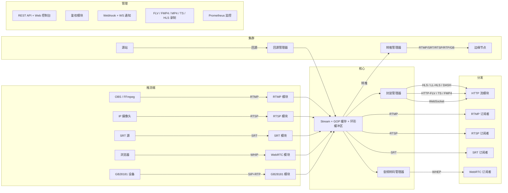

<div align="center">

# LiveForge

**Go 语言编写的高性能多协议直播流媒体服务器**

[](https://go.dev)
[](LICENSE)
[](https://github.com/im-pingo/liveforge/actions/workflows/ci.yml)

[English](README.md) | [中文](README.zh-CN.md)

---

**[📖 Wiki 文档 (中文)](../../wiki/Home-zh) | [📖 Wiki Documentation (EN)](../../wiki)**

*完整的部署指南、配置说明、集群拓扑、GB28181、音频转码等详细文档。*

源码级架构说明：[中文架构分析](docs/architecture.zh-CN.md)

</div>

---

LiveForge 是一个模块化的直播流媒体服务器，支持实时音视频的接入、转封装和分发。支持 RTMP、RTSP、SRT、WebRTC（WHIP/WHEP）、HLS、LL-HLS、DASH、HTTP-FLV、FMP4、GB28181 和 WebSocket 推拉流，使用单一服务进程运行。默认构建不需要原生 FFmpeg；启用音频转码时需要 `audiocodec` 构建标签、CGO 和 FFmpeg/libav 库。

## 亮点

| | 特性 | 说明 |
|-|------|------|
| 🔀 | **任意协议互通** | RTMP 推流 WebRTC 拉取，WebRTC 推流 HLS 播放 —— 任意组合即开即用 |
| 🎵 | **按需音频转码** | 跨协议自动桥接音频编解码（AAC ↔ Opus ↔ G.711 ↔ MP3），基于 FFmpeg/libav |
| 📡 | **GB28181 视频监控** | 完整 SIP 信令栈，设备注册、实时拉流、录像回放、云台控制、报警处理 —— 附带内置设备模拟器 |
| 🌐 | **多协议集群** | 支持 RTMP / SRT / RTSP / RTP / GB28181 的 Origin-Edge 级联，支持 HTTP 调度回调动态拓扑 |
| ⚡ | **LL-HLS 低延迟** | fMP4 部分分片、阻塞式播放列表刷新（`_HLS_msn`/`_HLS_part`）、增量播放列表 |
| 🖥️ | **Web 控制台** | 权限感知标签页依次为 Streams、GB28181、Config、Cluster、SIP Calls、Storage、Security；Recent Audit 位于 Security 内部；按 Workspace、Operations、System 分组；Streams 提供稳定行和行内四指标趋势；`/console/publish` 是支持 WHIP/SIP/GB28181 的主播工作台 |
| 🛡️ | **生产级可靠性** | 慢消费者保护（EWMA 丢帧）、GCC 拥塞控制、IP 级限流、Prometheus 监控 |

## 特性

### 协议支持

- **多协议推流** — RTMP、RTSP（TCP + UDP，兼容符合会话条件的独立音视频轨 SETUP）、SRT、WebRTC WHIP、GB28181，兼容 OBS、FFmpeg、GStreamer 及浏览器
- **多协议拉流** — RTMP、RTSP、SRT、WebRTC WHEP、HLS、LL-HLS、DASH、HTTP-FLV、HTTP-TS、FMP4、WebSocket
- **连续 HTTP 流完整性** — HTTP-FLV、HTTP-TS、FMP4 及其 WebSocket 输出在 ring overwrite 时立即终止，不会发送保留的 gap 后数据来跨越媒体断点
- **分片 overwrite 处理** — HLS 和 LL-HLS 丢弃未完成媒体，按需重新打开刷新后的直接/转码音频源，并以一次 discontinuity 从 live 位置恢复（视频等待关键帧，纯音频立即恢复）；LL-HLS 已保留的 fMP4 媒体继续引用匹配且不可变的版本化 init，DASH 则保留已完成的单 Period 媒体并退休受影响 manager
- **SRT** — 安全可靠传输，AES 加密，低延迟 MPEG-TS 传输（纯 Go 实现 `datarhei/gosrt`）
- **WebRTC** — WHIP/WHEP（SDP offer 上限 1 MiB）、ICE Lite、GCC 发送端带宽估计、浏览器推流
- **编解码** — H.264、H.265/HEVC、VP8、VP9、AV1、AAC、Opus、G.711（μ-law/A-law）、MP3

### 音频转码

在带 `audiocodec` 标签并具备 FFmpeg/libav 的构建中，LiveForge 可以在协议之间透明桥接音频编解码器。当订阅者需要的音频编解码与推流者不同时，按需转码自动生效 —— 无需任何配置。便携 no-CGO 构建只保证兼容音频透传，不支持的音频可能被省略，但仍保留可播放的视频。

| 推流 → 拉流 | 转码路径 | 典型场景 |
|-------------|----------|----------|
| RTMP (AAC) → WebRTC (Opus) | AAC → PCM → Opus | 浏览器播放 RTMP 流 |
| WebRTC (Opus) → RTMP (AAC) | Opus → PCM → AAC | 浏览器推流转推到 CDN |
| GB28181 (G.711) → HLS (AAC) | G.711 → PCM → AAC | 监控摄像头到 Web 播放 |
| 任意 → 任意（带标签构建） | 解码 → 重采样 → 编码 | 支持的音频 codec 组合 |

转码实例**按目标编解码共享** —— 多个请求同一编解码的订阅者共享一个转码管线。当推流和拉流编解码一致时，帧零开销透传。

> 编译时需要 `audiocodec` 构建标签、CGO 和 FFmpeg/libav 开发库。详见 [Wiki: 音频转码](../../wiki/Audio-Transcoding-zh)。

### GB28181 视频监控

完整支持 GB/T 28181 国标协议，接入 IP 摄像头和 NVR：

- **SIP 信令** — 设备注册、心跳检测、Digest 鉴权
- **设备目录查询** — 自动发现设备和通道
- **实时拉流** — 服务端主动 INVITE 拉取摄像头实时画面
- **录像回放** — 按时间范围回放设备端录像
- **云台控制** — 按 GB28181 附录 A 规范发送 PTZ 指令（方向、变焦、预置位）
- **报警处理** — 接收和处理设备报警通知
- **MPEG-PS 解封装** — RTP/PS 流接收，提取 H.264 + AAC
- **REST API** — 完整的设备/通道/会话管理 `/api/v1/gb28181/*`
- **统一流管理** — GB28181 流接入流中心后，可通过任意输出协议播放（HLS、RTMP、WebRTC 等）

> 详见 [Wiki: GB28181 指南](../../wiki/GB28181-zh)。

### GB28181 设备模拟器

内置模拟器（`tools/gb28181-sim`）模拟 GB28181 IPC 摄像头，用于验收测试：

```bash
# 编译运行模拟器
go run ./tools/gb28181-sim -server 127.0.0.1:5060 -fps 25

# 可定制：设备 ID、域、传输协议、心跳间隔、音频开关
go run ./tools/gb28181-sim \
  -device-id 34020000001110000001 \
  -domain 3402000000 \
  -transport udp \
  -keepalive 30s \
  -no-audio
```

模拟器执行流程：SIP REGISTER → 周期性心跳 → 响应目录查询 → 收到 INVITE 后发送 RTP/PS（H.264+AAC）→ 处理 BYE。

### 集群方案

多协议转推和按需回源拉流，构建 CDN 级联拓扑：

- **转推（Forward）** — 推流时自动转推到下游节点
- **回源（Origin Pull）** — 有订阅者时按需从上游拉流，空闲自动断开
- **多协议中继** — RTMP、SRT、RTSP、RTP、GB28181 传输
- **HTTP 调度器** — 通过外部 HTTP 回调动态解析目标节点，或使用静态目标列表
- **拓扑模式** — 单层（Origin-Edge）、多边缘（Origin-Multi-Edge）、三级级联（Origin-Center-Edge）
- **重试与容错** — 可配置重试次数、间隔和退避
- **转发热路径** — Relay reader 使用独立阻塞等待；WHEP 为 source 和 target-audio reader 各使用一个 condition-backed pump，使 readiness 与原子读取不会并发竞争；RTMP 转推复用 FLV 编码缓冲区，RTSP interleaved 使用向量写入，relay 字节指标首包即时提交、后续批量更新，降低逐帧开销

> 详见 [Wiki: 集群部署](../../wiki/Cluster-Deployment-zh)。

可用以下命令测量转发热路径：`go test -bench='BenchmarkRingReader|BenchmarkRTMPConn' -benchmem ./pkg/util ./module/cluster`。基准结果取决于运行机器，不代表固定容量保证。

生产回归还覆盖 bitrate-limit 接纳缓存和带 FFmpeg 的共享转码 fanout：`go test -run '^$' -bench 'BenchmarkStreamIngressProduction|BenchmarkStreamIngressWithBitrateLimit|BenchmarkRTMPRelaySendMediaFrameProduction|BenchmarkRTSPRelaySendFrameProduction|BenchmarkRelayObservationAccounting' -benchmem -count=3 ./core ./module/cluster`；带 `audiocodec` 标签时运行 `go test -tags audiocodec -run '^$' -bench '^BenchmarkTranscodeReaderFanoutAdmission$' -benchmem -count=3 ./core`。这些是有界回归测量，不是部署容量保证。

可用 `go test -run '^$' -bench 'BenchmarkStreamIngressProduction|BenchmarkRTMPRelaySendMediaFrameProduction|BenchmarkRTSPRelaySendFrameProduction|BenchmarkRelayObservationAccounting' -benchmem -count=3 ./core ./module/cluster` 测量更接近生产路径的回归基准，其中包括稳定 publisher 校验、Stream ring/GOP 写入、完整 RTMP FLV/chunk framing、RTSP H.264 packetizer/RTP/interleaved framing 和有界 relay 字节统计。在 Apple M1 Pro、Go 1.26.0 上，三次结果为：稳定 Stream ingress 65.86-67.28 ns/op（29 B/op，0 allocs/op），RTMP H.264 155.1-155.6 ns/op（24 B/op，3 allocs/op），RTMP AAC 73.60-73.76 ns/op（21 B/op，3 allocs/op），RTSP 单 NAL H.264 1.825-1.833 us/op（4,044 B/op，9 allocs/op），RTSP 三包 FU-A H.264 4.593-4.605 us/op（9,892 B/op，23 allocs/op）。Stream 使用共享只读 payload 的预分配 64 秒单调时间戳、25 fps H.264/50 fps G.711A 帧池，零 subscriber，关闭 bitrate limit，保留 2 个 GOP，单 GOP 上限 300 帧，ring 为 4,096 项。RTMP 使用固定时间戳媒体帧和 payload 字节统计，RTSP 使用固定时间戳 RTP 输入和 framed-byte 统计；两种 egress 都终止于有界内存 writer，不包含 socket write、TCP writev、deadline 和内核/网络 syscall。独立 accounting 的 ns/op 还排除了生产 context lookup，主要用于 allocation 回归。该 fixture 与更窄的旧 `BenchmarkStreamWriteFrame` 微基准不可直接比较，也不代表订阅数、并发或部署容量。

Stream 并发回归矩阵可运行：`go test -run '^$' -bench '^BenchmarkStreamIngressMatrix$' -benchtime=100ms -benchmem -count=3 ./core`。它覆盖 1、8、32 个独立 Stream，以及每流 0、4、16 个进程内 RingBuffer reader；benchmark 和 race 测试是回归证据，不是部署容量保证。

Prometheus 有界 cardinality 矩阵可运行：`go test ./module/metrics -run '^$' -bench '^BenchmarkMetricsCardinalityMatrix$' -benchtime=100ms -benchmem -count=3`。它覆盖 1000 个活跃流、limit 32/512、1000 项精确 allowlist 和 8 路并发 Gather；admission key 使用不可变快照，稳定 Gather 不持有 admission mutex。

### LL-HLS（低延迟 HLS）

Apple LL-HLS 标准实现，亚秒级延迟 HLS 分发：

- **部分分片** — 可配置 Part 时长（默认 200ms），细粒度分发
- **阻塞式播放列表刷新** — 支持 `_HLS_msn` 和 `_HLS_part` 查询参数
- **增量播放列表** — 支持 `_HLS_skip=YES` 减少传输量
- **fMP4 容器** — 默认 fMP4，可选 TS 回退
- **fMP4 分片解析** — 可解析由多个 `moof`/`mdat` fragment 拼接成的完整媒体分片，不会丢弃前面的 fragment
- **fMP4 AAC 时间** — 未显式提供 AAC 采样率和声道数时从 AudioSpecificConfig 推导，并复用解析出的采样率作为媒体 timescale，保持 DTS 间隔稳定
- **兼容旧播放器** — 无 LL-HLS 支持的播放器自动降级为缓冲分片模式
- **关键帧对齐启动** — GOP 缓存与实时帧保持连续；HLS、LL-HLS 和 DASH 分段器会等待当前 publisher generation 的必要序列头，并从同一个启动快照绑定序列头、回放帧和实时游标。Hls.js 的初始清单等待一个完整分段但不重复公告其 part。等待上限覆盖配置的完整分段目标加一个 part（下限 10 秒、上限 30 秒）；若仍无完整分段则返回 503，而不是只包含 part 的清单。后续阻塞刷新保留最近已完成 part 的身份并继续消费新的低延迟 part；DASH 同样在一个完整分段后启动、采用一个 fragment 的直播延迟，且 MPD 最迟每两秒刷新。清单和分片只在真正写响应前启动 write deadline，等待首段不会提前消耗写窗口。HLS、LL-HLS 和 DASH 清单会逐段转义流键，DASH URL 属性同时进行 XML 转义，媒体分片路由可保留任意深度的有效流键
- **generation 安全完成** — Publisher stop 会先从新请求查找中移除匹配的 HLS、DASH 或 LL-HLS manager，但 manager 会继续排空该 generation 捕获的结束游标之前已经接纳的全部帧，并且只完成一次。替代 publisher 使用不同 manager，不会把新旧 generation 帧写入对方输出。LL-HLS 阻塞刷新也会在 manager 停止时退出；HTTP 模块关闭会强制停止并等待 active 和 draining manager worker

### 管理与运维

- **Web 控制台** — 七个权限感知标签页及多协议预览，并提供独立的 `/console/publish` 主播工作台。所有管理页统一使用 console demo 的深青黑底色与 mint/cyan/amber/coral 色彩系统。Streams 使用固定列宽并恢复 Preview 操作，点击流行会在该行下方展开四张同时显示的紧凑 60 秒趋势图（码率、视频 FPS、音频 FPS、GOP 时长），每秒采样一次。主播工作台可在 WHIP/WebRTC、SIP、GB28181 之间选择协议，并复用现有协议实验室生命周期。Recent Audit 是 Security 内部的界面，不是单独的第八个标签页。
- **REST API** — 流生命周期、配置刷新/状态、集群状态、SIP 呼叫、录制/DVR、安全/审计、GB28181 和公开健康探针
- **鉴权与 RBAC** — viewer/operator/admin 命名令牌、控制台会话、推拉流 JWT/回调鉴权，以及有界脱敏审计记录
- **录制与 DVR** — FLV、FMP4、MP4、MPEG-TS、HLS 录制；新录像默认使用 fMP4/`.mp4`；每个轮转录像文件都会保留已声明轨道和最新 codec 初始化，并让每条轨道从文件内零时间轴开始，确保文件可独立解析；TS 会在首个媒体 PES 前写入 PAT/PMT，经典 MP4 按音视频各自时钟计算 duration、对超出 version-0 表示范围的时间字段做饱和而不回绕、对负 B 帧合成偏移使用有符号 `ctts` version 1，并使用可扩展 AAC ESDS 长度编码；fMP4 仅直接写入 AAC，启用可选 `audiocodec`/FFmpeg 构建时会将 G.711、Opus、MP3 等非 AAC 音频转为 AAC，未启用时过滤音频并保留可播放的纯视频输出；转码录制停止时会先排空停止边界前已经提交的源帧再完成文件，publisher generation 结束时还会先排空重采样滤波器保留的样本，再用静音补齐最后一个不完整 PCM 帧，并在 Record/DVR 输出关闭前仅一次排空编码器延迟包；DVR TS 同样会将目标不支持的音频统一转换；支持分段、存储健康、下载/Range/在线预览/删除管理、精确完整 ID 操作路由、清理失败后可重试且最后删除主文件、零字节会话保护和时移状态。录制在线预览/下载会在打开媒体前占用全局连接配额，并设置 10 秒写期限。
- **录制/DVR 状态与路由** — 只有 `completed` 录像可以下载或在线播放；`active` 和 `failed` 状态统一返回 JSON `409`，不会返回媒体字节。录制格式为 `flv`、`fmp4`、`mp4`、`ts` 和 `hls`（`hls` 按 TS 存储），`max_size` 只接受空值/零值或带 `B`/`KB`/`MB`/`GB` 的十进制字节数。纯音频 DVR 在 publisher 仍在线时按音频 DTS 达到分段时长立即发布分片。DVR 嵌套流键保留 `/` 层级，拒绝编码分隔符和点段，并对每个流键段独立转义 `?`、`#`、`%`；`/api/v1/server/info` 返回已绑定的非零 DVR 端口及实际 HTTP/TLS scheme。
- **GB28181 录制匹配** — `record.stream_pattern` 匹配完整流键；普通入站流使用 `{gb28181.stream_prefix}/{channel_id}`，因此要录制默认 GB28181 流请使用 `gb28181/*` 或 `*`，`live/*` 不会匹配。录制路径支持受信任配置中的 `${HOME}` 和 `~/...`，创建存储前会解析到进程用户目录，命名用户路径会被拒绝，录制状态会显示解析后的 storage root。录制会话仅在 generation 尚未声明任何 codec 时等待同一 publisher generation 的媒体头，覆盖 GB28181 在 SIP/PS 接纳后才发现 codec 的流程；已声明 codec 的 publisher 可以在 sequence header 到达前开始录制。
- **本地协议实验室** — SIP 和 GB28181 页面可在不依赖其他平台或设备的情况下运行一次性及持久假设备检查。SIP 使用独立的 H.264 与 PCMA/PCMU RTP/RTCP 轨道，接收模式不会改写源流；接收模式会在发送信令前等待当前 publisher generation 的必要序列头，并把所选 PCMA/PCMU 作为真实出站目标 codec。源 codec 不同时，带标签且具备能力的运行时使用 generation 绑定的共享音频转码 reader，H.264 仍从原始 live cursor 读取；不支持的转换会立即拒绝。GB28181 发布模式注册一个可监听的假设备，并经过 LiveForge 正常的服务端主动点播及真实 RTP/RTCP 接收路径；接收模式要求 H.264 加直接 G.711A，或带标签运行时可转换为 G.711A 的音频；转码音频使用独立且绑定 generation 的 reader，H.264 保持直接读取，并在模块自己的 PS/RTP/RTCP 出站会话激活前同步接纳源流订阅者。订阅者上限拒绝会让启动同步失败；后续媒体发送失败会把 Lab 转为 `failed` 并释放信令及媒体资源。无外部依赖的 160x90 动态测试图以 25fps 运行、每秒一个 IDR，并生成可听的 20ms 音频帧。持久 GB28181 会话会按 `gb28181.keepalive.timeout` 的约三分之一持续发送 Keepalive。两者共用 SIP 监听端口时，H.264 加 PCMA/PCMU RTP offer 交给 SIP Gateway，PS/90000 offer 交给 GB28181
- **协议实验室接纳上限** — `sip.gateway.max_lab_sessions` 和 `gb28181.max_lab_sessions` 分别限制持久实验室的活跃会话；默认值为 16，终态历史不占用上限，非正值使用默认值，达到上限时会在分配 socket 或媒体资源前返回 HTTP 429
- **SIP RTP 端口所有权** — Gateway 媒体端口会跳过外部占用并在 SDP 协商期间保持 socket 已绑定；Lab 假端点同时避开 Gateway 配置的 RTP 范围
- **SIP 出站退役** — 请求的 PCMA/PCMU 转换使用独立且绑定 publisher generation 的音频 reader。每个就绪帧会先完成 packetize，再在终态 send gate 下进行最终发送准入，同时复查取消状态和当前 publisher generation。终态清理先关闭准入和自有 socket，在不持有 lifecycle 或 admission 锁时等待已准入发送退出，之后才发布终态与回调；publisher 退役会释放转码 reader 和订阅者、回收 RTP/RTCP 端口对，并在并发触发其他清理时仍只发送一个 BYE
- **SIP overwrite 恢复** — SIP 出站会丢弃跨越媒体断点的保留帧，并且只推进发生 overwrite 的 source 或 target-audio reader。source 断点不会中断有效转码音频，直接 H.264 会等待同一 generation 的最新序列头和 IDR；target-audio 断点不会中断直接视频，音频会从 live 位置恢复。generation 仍活跃时 target-audio EOF 会让呼叫以 `network_lost` 失败，双 reader 父循环会在返回前取消并等待两个媒体 pump 退出
- **协议实验室流键** — SIP 和 GB28181 接受最长 256 字节的可打印 ASCII 流键；以 `/` 分隔的每一段都不能为空，也不能是 `.` 或 `..`。GB28181 发布仅对 loopback 模拟器使用请求中的流键，真实设备仍使用 `{stream_prefix}/{channel_id}`
- **GB28181 PS 兼容性** — PS 出站会把内部 AVCC/HVCC 视频样本转换为 Annex-B，保证真实 GB28181 接收端能解码视频
- **GB28181 覆盖恢复** — PS/RTP 出站会在发送待发媒体前串行处理源与转码音频 control result，丢弃被覆盖值和 gap 前待发媒体，只推进发生覆盖的 reader，并保持未受影响媒体连续。源 gap 会在不重置 RTP 序列号的前提下创建新 PS 状态，等到 gap 后最新序列头加 IDR 才恢复 H.264；转码音频 gap 则保留干净的视频和 PS 状态，也不会重置其原有的 20ms holdback deadline
- **实验室诊断** — Manager 保留全部活跃会话和最新 16 条终态记录。失败会话的有界 `last_error` 会先移除 SIP 凭据与 bearer token；会话视图展示接收端 RTCP 及独立音视频计数。播放路径会逐段转义流键，并按实际绑定监听器生成 RTMP/RTSP 绝对地址；Console 的 Lab Preview 直接使用这些返回路径
- **启动回滚** — 监听器或模块初始化失败时保留并报告原始错误，只关闭已经尝试初始化的模块，不会在回滚尚未初始化的后续模块时 panic
- **通知** — HTTP Webhook（HMAC-SHA256 签名）和 WebSocket 实时事件
- **Prometheus 监控** — 启用模块后始终提供服务器级指标，流级码率、帧率、GOP 和订阅者 label 默认关闭。未配置 allowlist 时，数量上限是单个 Collector 整个生命周期的 cardinality 预算：活跃流键按创建顺序接纳，流消失后仅保留标量键且槽位不因 churn 复用。精确 allowlist 定义唯一可选流键，上限仍约束每次抓取。`stream_detail_limit: 0` 会关闭流级 series；负数配置无效并会被拒绝。需要查看当前流请使用管理 API，需要固定 Prometheus label 请配置精确 allowlist
- **限流** — IP 级令牌桶，防止连接洪泛；可信代理链从右向左解析，攻击者控制的 XFF 左侧前缀不能切换限流桶
- **HTTP 连接超时** — API、WebRTC 信令和 metrics 监听器将请求头解析限制为 5 秒，将空闲 keep-alive 连接限制为 2 分钟；现有写入 deadline 保持不变
- **慢消费者保护** — 基于 EWMA 的延迟检测，渐进式丢帧
- **GCC 拥塞控制** — WebRTC WHEP 发送端带宽估计，自适应码率
- **按 generation 绑定起播** — SIP、GB28181、录制、DVR 和集群出站使用同一个 publisher 原子快照，只在协议需要时重放当前 headers/GOP 一次，再从 live cursor 接续。DVR 会将已校验快照贯穿保留索引/存储恢复，并在安装 session 前再次检查 generation；设置期间发生替代时会丢弃候选 session。DVR shutdown 会在等待 setup 所有权之前启动绝对 drain deadline，因此阻塞的 setup 不能延长配置的关闭边界。SIP inbound INVITE 会在分配 RTP 端口前执行同步发布鉴权，激活后发送匹配的 start/stop 生命周期事件，因此录制和 DVR 能跟随并收尾 SIP 会话。publisher 替换会取消旧 reader，纯音频不会重放保留历史，只有 sequence header 的录制会失败而不会发布为成功媒体
- **Publisher 所有权隔离** — 每个非空 publisher ID 在一个 `Stream` 对象生命周期内只能创建一个 generation。即使中间出现 B，再次使用 A 也会在任何流状态变化前被拒绝，因此 A 的延迟帧、活动和清理回调不能影响当前 owner；新创建的 `Stream` 拥有独立的 identity 生命周期。流一旦开始销毁，延迟清理不能把它恢复为可挂接状态，也不能重开已关闭的 ring
- **GOP 上限热更新** — 收紧帧数、时长或字节上限会保留所有启用上限共同允许的最短关键帧起始可播放前缀，并可能立即封存；时长按观测到的 DTS 最小值与最大值之间的完整无序跨度计算，不重排媒体。启用 GOP 缓存时至少要保留一个正的帧数或字节硬上限，零只禁用对应上限。放宽后只有当前保留 GOP 能接纳后续交错音视频帧，旧 GOP 保持裁剪，已省略帧不会恢复，下一个关键帧会开始新的完整 GOP

## 架构


```mermaid
graph LR
    subgraph 推流端
        OBS[OBS / FFmpeg] -->|RTMP| RTMP_MOD[RTMP 模块]
        CAM[IP 摄像头] -->|RTSP| RTSP_MOD[RTSP 模块]
        SRT_PUB[SRT 源] -->|SRT| SRT_MOD[SRT 模块]
        BROWSER_PUB[浏览器] -->|WHIP| WEBRTC_MOD[WebRTC 模块]
        GB_DEV[GB28181 设备] -->|SIP+RTP| GB_MOD[GB28181 模块]
    end

    subgraph 核心
        RTMP_MOD --> STREAM[Stream + GOP 缓存 + 环形缓冲区]
        RTSP_MOD --> STREAM
        SRT_MOD --> STREAM
        WEBRTC_MOD --> STREAM
        GB_MOD --> STREAM
        STREAM --> TRANSCODE[音频转码管理器]
        STREAM --> MUXER[封装管理器]
    end

    subgraph 分发
        MUXER -->|HLS / LL-HLS / DASH| HTTP_MOD[HTTP 流模块]
        MUXER -->|HTTP-FLV / TS / FMP4| HTTP_MOD
        MUXER -->|WebSocket| HTTP_MOD
        STREAM -->|RTMP| RTMP_SUB[RTMP 订阅者]
        STREAM -->|RTSP| RTSP_SUB[RTSP 订阅者]
        STREAM -->|SRT| SRT_SUB[SRT 订阅者]
        TRANSCODE -->|WHEP| WEBRTC_SUB[WebRTC 订阅者]
    end

    subgraph 集群
        STREAM -->|转推| FWD[转推管理器]
        FWD -->|RTMP/SRT/RTSP/RTP/GB| EDGE[边缘节点]
        ORIGIN[源站] -->|回源| OPL[回源管理器]
        OPL --> STREAM
    end

    subgraph 管理
        API[REST API + Web 控制台]
        AUTH[鉴权模块]
        NOTIFY[Webhook + WS 通知]
        RECORD[FLV / FMP4 / MP4 / TS / HLS 录制]
        METRICS[Prometheus 监控]
    end
```

## 快速开始

### Docker 部署（本地构建或已发布镜像）

发布工作流在推送 `v*` 标签并成功完成后，才会将版本化镜像发布到 `ghcr.io/im-pingo/liveforge`。如需匿名拉取，请将 GHCR 包设为 Public；私有包需先执行 `docker login ghcr.io`。首次发布前请使用下方的 docker compose 本地构建；使用已发布镜像时请固定版本号，不要依赖 `latest`。

```bash
docker run -d --name liveforge \
  -p 1935:1935 -p 8554:8554 -p 8080:8080 -p 8443:8443 \
  -p 6000:6000 -p 5060:5060/udp -p 8090:8090 \
  ghcr.io/im-pingo/liveforge:vX.Y.Z
```

或使用 docker compose：

```bash
git clone https://github.com/im-pingo/liveforge.git
cd liveforge
docker compose up -d
```

打开 `http://localhost:8090/console` 访问 Web 控制台。

使用自定义配置：

```bash
docker run -d --name liveforge \
  -v /path/to/liveforge.yaml:/etc/liveforge/liveforge.yaml:ro \
  -p 1935:1935 -p 8554:8554 -p 8080:8080 -p 8443:8443 \
  -p 6000:6000 -p 5060:5060/udp -p 8090:8090 \
  ghcr.io/im-pingo/liveforge:vX.Y.Z
```

### 源码编译

```bash
git clone https://github.com/im-pingo/liveforge.git
cd liveforge
go build -o liveforge ./cmd/liveforge
./liveforge -c configs/liveforge.yaml
```

> 启用音频转码需带 CGO 和 FFmpeg/libav 编译：
> ```bash
> CGO_ENABLED=1 go build -tags audiocodec -o liveforge ./cmd/liveforge
> ```

### 推流

**RTMP（OBS / FFmpeg）：**
```bash
ffmpeg -re -i input.mp4 -c copy -f flv rtmp://localhost:1935/live/stream1
```

**RTSP：**
```bash
ffmpeg -re -i input.mp4 -c copy -f rtsp rtsp://localhost:8554/live/stream1
```

**SRT：**
```bash
ffmpeg -re -i input.mp4 -c copy -f mpegts "srt://localhost:6000?streamid=publish:/live/stream1"
```

**WebRTC（浏览器）：**
打开 `http://localhost:8090/console`，点击 **"+ WebRTC Publish"**，选择摄像头/麦克风后开始推流。

当浏览器和操作系统提供 H.265 WebRTC 编码器时，控制台可以推送 H.265/HEVC 视频和 Opus 音频。WHIP 会把音频和视频 RTP 映射到同一个会话时间线，HLS/DASH/FLV/TS 使用从缓存 GOP 源游标开始的组合转码 reader，让目标音频历史和实时视频连续进入输出，避免首帧冻结和重复缓存视频。FMP4 预览在共享 muxer 启动时建立接近零的时间线并保留 B 帧的有符号合成偏移，晚加入的订阅从自身首个缓冲时间戳开始播放。对于 G.711 源，只有当 `GET /api/v1/server/info` 报告当前进程已配置且实际具备两种 G.711 到 AAC 的转码能力时，控制台才会在 FMP4 SourceBuffer 中声明 AAC；便携构建仍使用纯视频声明。WHEP Live 回放原子缓存 GOP 后，从与快照匹配的 ring 游标继续读取源视频，并通过独立 reader 获取转码后的目标音频。WebRTC 转码 worker 等待新帧时不会消费源播放唤醒信号，因此即使源音频暂停，视频节奏也能保持稳定。带 `audiocodec` 标签的构建是完整跨协议配置，验收步骤见 [WHIP H.265 + Opus 播放验证](docs/recipes/whip-h265-opus-playback.md)。

控制台默认的 WHEP 预览使用带缓存的 live 启动路径，正常 H.264 GOP 不必等待 snapshot 之后的 IDR。协议实验室分别返回 `whep`/`whep_live`（`mode=live`）和 `whep_realtime`（`mode=realtime`）路径。源中存在且 offer 实际请求的每条音视频轨都必须成功协商：不支持的请求 codec 返回 415，内部建轨失败返回 500，不能静默只保留另一条轨；端口为 0 或方向不接收的 m-line 仍视为有意省略。接收方向优先使用媒体级属性，否则继承会话级属性；codec 只与该 m-line 实际列出的 payload 的精确 `rtpmap` 名称匹配。显式 realtime 模式会显示可区分的“等待关键帧”状态；即使混合流音频已推进，只要视频仍在首个 IDR 前丢弃非关键帧，就不会误报 `media_stalled`。播放期间，WHEP 会把源 reader 或转码音频 reader 的覆盖事件绑定到各自的原子读取结果，丢弃覆盖后的保留帧，并且只把受影响的 reader 推进到 live。每个 reader 的 readiness、原子读取和 live 推进都由同一个 condition-backed pump 独占；关闭时先取消并等待两个 pump，再且仅一次释放转码音频所有权。源 reader 覆盖时，已建立的音频继续推进，视频回到 `waiting_keyframe`，重置 pacing/DTS/PTS 状态，并从同一 generation 的最新参数集加关键帧恢复；纯音频从下一帧 live 音频继续。目标音频 reader 覆盖不会扰动干净的视频；期望的目标音频在 active generation 中 EOF 时会以 `target_audio_failed` 终止，而不是静默降级为纯视频。`GET /webrtc/session/{sessionId}/status` 提供期望媒体种类、首个成功样本时间和固定的 `first_media_wait_ms`、每种媒体最后推进时间、generation、游标、媒体计数、真实 RTP 包/字节、收到的 RTCP 包和有界 sample-write 错误。dropped 只统计已协商轨；会话关闭会在保存终态前捕获一次最终的单调 transport 计数。所有请求轨都推进后才能进入 `playing`；启动后任一期望媒体连续 8 秒没有推进会进入可恢复的 `media_stalled`，所有过期媒体重新推进后才恢复；Console 使用服务端时间只列出实际过期的媒体种类。每次真实状态迁移只写一条结构化日志，包含 generation、游标、模式、前后状态以及存在时的有界错误；每次覆盖另写一条有界 warning，包含 reader 身份、精确覆盖计数和恢复动作。Feed 终止会自动关闭并释放会话，最多 64 条终态仍可读取两分钟。带标签的 Chromium 矩阵会验证 SIP 发布到 GB28181 接收加 WHEP、GB28181 发布到 SIP 接收加 WHEP，以及 WHIP H.264/Opus 发布到 SIP 与 GB28181 接收加 WHEP。验收要求预期解码尺寸、媒体时间、视频/音频 RTP 和解码帧计数持续推进、ICE 已连接且服务端 RTP/RTCP 状态未 stalled；设置 `LIVEFORGE_PROTOCOL_MATRIX_SOAK=60s` 可按秒延长检查，但不代表部署容量结论。详见[技术风险记录](docs/TECHNICAL-RISKS.md)；SDP 协商成功或触发 `ontrack` 都不能单独证明已经播放。

WHEP 状态还提供 `source_overwrites`，表示恢复期间 source ring 丢失的 position 数。它不会计入 `dropped_video` 或 `dropped_audio`，因为混合源 ring 无法把每个丢失 position 可靠归类到单一媒体类型；直接音频 pacing 会在同一恢复边界重置，转码后的 target-audio pacing 保持独立。

**GB28181：**
将 IP 摄像头的 SIP 服务器指向 `localhost:5060`，或使用内置模拟器：
```bash
go run ./tools/gb28181-sim -server 127.0.0.1:5060
```

### 拉流

| 协议 | 地址 |
|------|------|
| RTMP | `rtmp://localhost:1935/live/stream1` |
| RTSP | `rtsp://localhost:8554/live/stream1` |
| SRT | `srt://localhost:6000?streamid=subscribe:/live/stream1` |
| HLS | `http://localhost:8080/live/stream1.m3u8` |
| LL-HLS | `http://localhost:8080/live/stream1.m3u8`（启用时自动切换） |
| DASH | `http://localhost:8080/live/stream1.mpd` |
| HTTP-FLV | `http://localhost:8080/live/stream1.flv` |
| HTTP-TS | `http://localhost:8080/live/stream1.ts` |
| FMP4 | `http://localhost:8080/live/stream1.mp4` |
| WebRTC | 打开控制台 → 点击 Preview → 选择 WebRTC 标签页 |

纯 AAC 音频源在推流仍进行时就会产生完整的 HLS、DASH 和 LL-HLS
分片。以 `live/audio` 为流 key 时，HLS/LL-HLS 播放列表为
`/live/audio.m3u8`，完整分片为 `/live/audio/0.ts` 或
`/live/audio/0.m4s`；DASH MPD 为 `/live/audio.mpd`，音频 init 为
`/live/audio/audio_init.mp4`，媒体分片为 `/live/audio/a1.m4s`。LL-HLS
的 `part_duration` 控制 part，`segment_duration` 控制完整 segment 且
默认为 `1.0` 秒。没有视频关键帧时，首个完整分片会在配置目标时长
附近完成，无需等待源停止。即使发布端的首个 DTS 为零，DASH 媒体分片
也会保持同一条连续的相对解码时间线。

### Web 控制台

访问 `http://localhost:8090/console` 打开实时管理仪表盘。预览 URL 使用服务端报告的实际 HTTP/WebRTC 监听地址。如果 nginx 或其他本地进程占用了 `127.0.0.1:8080`，RTMP 和 WHEP 可能正常，但 HTTP-FLV/HLS/DASH/FMP4 预览会收到占用进程的 404；请释放该端口，或将 `http_stream.listen` 改为未占用的地址。

标签页顺序为 Streams, GB28181, Config, Cluster, SIP Calls, Storage, and Security。Recent Audit 是 Security 内部的界面，不是单独的第八个标签页。视觉分组为 Workspace（Streams、GB28181、SIP Calls、Storage）、Operations（Cluster）和 System（Config、Security）。API 监听器启用 TLS 时，控制台登录签发的 HttpOnly、SameSite=Strict `lf_session` Cookie 会设置 `Secure`；本地纯 HTTP 监听器不会设置该属性。

- 流列表：状态、编解码器、码率、帧率，以及正在运行的音频转码任务（`源 -> 目标`、状态、订阅数和有界错误）
- GOP Cache 可视化，显示随关键帧递增的 generation、交错的视频/音频帧数和时长；纯音频流显示 `Not applicable (audio-only)`。选中流的四条趋势在普通 GOP 轮换时保持连续 60 秒窗口，仅在 publisher 或计数器重置时重新开始
- 多协议预览播放器（HTTP-FLV、WS-FLV、HTTP-TS、FMP4、HLS、DASH、WebRTC 实时模式和 WebRTC Live 模式）
- WebRTC 推流（摄像头/麦克风 + 发送端统计）
- 权限感知的踢流、删流和运行时配置刷新
- 集群 relay/peer 状态，以及 SIP 呼叫发起、详情和挂断
- 录制详情/下载/在线预览/删除、DVR 会话/存储状态及 HLS 在线预览、安全状态和有界审计事件
- WHEP 预览在浏览器自动播放策略需要时会让异步收到的媒体先静音启动，并提供 Unmute/Mute 控件恢复音频，不丢失音频轨
- 当源音频 codec 不在浏览器 offer 中时，WHEP 优先转为 Opus，并在运行时具备 `audiocodec` 能力时回退到 offer 中的 PCMU/PCMA；answer 会使用目标 codec 对应的 RTP 格式（Opus 48 kHz 双声道、G.711 8 kHz 单声道），Streams API 和流列表显示有界 `transcode_tasks` 诊断
- 完整脱敏 Config 文档/schema 展示、只读 Validate、按数据源执行 Apply & Refresh，并显示 file、HTTP/HTTPS、Consul、Redis 的可写/只读状态
- SIP 和 GB28181 本地协议实验室结果，以及模块不可用状态；两者都支持无需外部平台的持久 H.264 加 G.711 模拟设备发布/接收，会话显示分轨 RTP/RTCP/PS 计数，停止时清理资源，并可通过已启用的其他输出协议预览

DVR 播放列表和分片 GET 只运行同步订阅鉴权钩子，不会触发异步订阅生命周期事件。
有限的 DVR 播放列表和分片响应使用 10 秒服务端写入上限。每个已接纳的成功、错误、取消或超时请求都只释放一个全局连接槽位；Range 请求和 `ServeContent` 元数据保持不变。
录制预览复用已认证的管理 API 会话；DVR 预览使用带非凭据 CORS 的独立 `dvr.listen` HLS 监听器，因此仍执行订阅鉴权，控制台不会持久化或拼接 bearer token。

## 配置

LiveForge 使用 bootstrap YAML 配置，并可通过 runtime source 持续读取配置。完整参考见 [`configs/liveforge.yaml`](configs/liveforge.yaml)。Config 页面会展示完整脱敏的 effective/desired 文档和 schema，支持校验，并在 file、HTTP/HTTPS、Consul、Redis 数据源可写时执行 Apply；只读数据源返回 409。详见 [`docs/recipes/runtime-config-sources.md`](docs/recipes/runtime-config-sources.md)。

仓库内示例配置仅用于本地开发：它关闭 TLS 和鉴权，并使用 `admin/admin`。禁止不做修改就暴露到公网。

主要配置段：

| 配置段 | 功能 |
|--------|------|
| `rtmp` | RTMP 推拉流（默认 `:1935`） |
| `rtsp` | RTSP 推拉流，TCP + UDP（默认 `:8554`） |
| `http_stream` | HLS、LL-HLS、DASH、HTTP-FLV、HTTP-TS、FMP4、WebSocket（默认 `:8080`）；`http_stream.llhls.segment_duration` 控制 LL-HLS 完整分段 |
| `webrtc` | WHIP/WHEP，ICE 服务器和 UDP 端口范围（默认 `:8443`） |
| `srt` | SRT 推拉流，AES 加密（默认 `:6000`） |
| `sip` | GB28181 SIP 信令服务器和本地 SIP Gateway 实验室（默认 `:5060`） |
| `gb28181` | GB28181 设备管理、RTP 端口范围、心跳、自动拉流 |
| `audio_codec` | 启用/禁用按需音频转码 |
| `api` | REST API 和 Web 控制台（默认 `:8090`） |
| `auth` | JWT 和 HTTP 回调鉴权 |
| `record` | FLV/FMP4/MP4/TS/HLS 录制、分段和完成回调 |
| `dvr` | 时移分片、保留窗口、存储和会话状态 |
| `notify` | HTTP Webhook 和 WebSocket 通知 |
| `cluster` | 多协议转推和回源拉流，支持调度器 |
| `metrics` | Prometheus 监控端点（默认 `:9090`） |
| `limits` | 全局连接数、流数、订阅者数限制 |
| `tls` | TLS 证书和密钥配置 |
| `stream` | GOP 缓存及单 GOP 帧数/时长/字节上限、环形缓冲区、空闲超时、慢消费者、反馈；Simulcast 字段仍延期 |
| `runtime` | 后台配置刷新源：文件、HTTP/HTTPS、Consul 或 Redis |

受信任的 bootstrap/runtime source 加载支持 `${API_TOKEN}`、`${AUTH_JWT_SECRET}` 等环境变量展开。面向 viewer 的 Config Validate 绝不会展开服务端进程环境变量，而是按字面值处理引用，只接受一个 YAML/JSON 文档，并拒绝 root 或 nested typed field 中的未知键。Config Apply 和受信任的 runtime source 加载仍允许 typed runtime struct 未映射的 source 字段。

### 运行时配置刷新

进程启动时只读取一次 bootstrap 配置文件，之后由后台管理器定期读取选定的 `runtime.source`，解析、校验后以原子快照发布。业务读取配置只做内存中的原子读取，不会触发文件/网络 I/O，也不会等待刷新。源加载、Config Apply 写入和关闭操作会串行执行；Apply 会等待数据源写入完成后返回 202，并返回 `status: written_and_refresh_scheduled`，再异步执行解析、模块应用和发布。file、HTTP/HTTPS、Consul、Redis 源默认都有 4 MiB 的完整文档/物化上限，可通过对应的 `runtime.<source>.max_bytes` 配置；Redis hash 优先使用 `HSCAN NOVALUES`，旧 Redis 只在明确不支持时退回 `HKEYS`，并继续使用有界的 `HSTRLEN/HGET` 批量读取。扁平化 Consul/Redis 叶子值只会推断安全的布尔值、null、规范十进制整数以及有限的十进制/指数浮点数；前导零标识符、时长、越界数值和类似 YAML 的字符串仍保持字符串。点号/斜杠扁平路径会先规范化并排序；重复路径以及标量/容器前缀冲突会以确定性的错误 fail closed。Config 页面展示完整的版本化 JSON Schema，并保留 source 原始 desired YAML，包括注释和 typed runtime struct 未映射的字段。脱敏文档会保留集合形状：不透明的结构化敏感值仅保留 `id`、`name`、`username`、`channel_id`、`device_id` 等明确的稳定标识字段；有效的 absolute hierarchical URL scalar 即使位于名称不符合 URL heuristic 的未映射字段中，也会按 value 识别，保留安全的 scheme/host/port 标识，同时把所有非 root path 替换为稳定的不透明 digest marker，并移除 userinfo/query/fragment。URL-shaped key 继续执行 TURN/opaque、malformed/hostless fail-closed 和 plain-address 规则；该 key policy 之外的普通 string、duration、ID 和 bare host/address 保持不变；占位符恢复存在歧义时会拒绝写入。配置源失败时继续使用最后一次有效快照。HTTP 源要求 `runtime.source` 的 `http` 或 `https` 与 URL 协议一致，禁止所有重定向，且 ETag/Last-Modified 仅在文档被接受后推进；`X-Config-Version` 是独立的版本元数据。Consul KV GET 和 PUT 同样拒绝重定向且不会向目标发出请求，因此绝不会转发 `X-Consul-Token`。`SIGHUP` 和 `POST /api/v1/server/config/refresh` 只会异步调度刷新。监听地址、模块开关、TLS、端口范围等变更会标记为需要重启，不会对运行中的监听器做部分切换。状态 API 和 Prometheus 会暴露接受、拒绝、应用失败、回调失败、回调合并丢弃和待重启状态。文件、HTTP、HTTPS、Consul、Redis 以及 Config Validate/Apply 示例见 [`docs/recipes/runtime-config-sources.md`](docs/recipes/runtime-config-sources.md)。

文件 Apply 创建新目标时使用私有权限 `0600`，替换已存在文件时保留原有权限位。Redis Apply 会在一个 `MULTI/EXEC` 事务中写入文档并递增可选的 version key，事务或 EXEC 错误会返回给调用方而不会虚报成功。刷新接口成功返回 `202` 和 `status: scheduled`；Apply 成功返回 `202` 和 `status: written_and_refresh_scheduled`。Console 使用单调递增的编辑版本号，Apply 之后返回的过期 desired 快照不能覆盖更新后的本地编辑文本。

Apply 写入成功后，服务端会在数据源刷新接受相同内容前保留一个内存中的 pending desired overlay。因此立刻刷新页面时，`GET /api/v1/server/config/document` 仍会返回刚提交的 desired 文档，而 effective 文档保持最近一次已应用的快照。

运维人员可通过 `GET /api/v1/server/config` 查看脱敏后的加载器状态（遵循 API 的现有鉴权规则）。

## 测试工具

### lf-test 命令行工具

综合集成测试工具（`tools/lf-test`），验证服务器全部功能：

```bash
# 推流测试（支持：rtmp, rtsp, srt, whip, gb28181）
go run ./tools/lf-test push --protocol rtmp --target rtmp://localhost:1935/live/test --realtime

# 拉流测试（支持：rtmp, rtsp, srt, whep, httpflv, wsflv, hls, llhls, dash）
go run ./tools/lf-test play --protocol hls --url http://localhost:8080/live/test.m3u8

# 集群拓扑测试（自动启动多节点集群）
go run ./tools/lf-test cluster \
  --topology origin-edge \
  --relay-protocol srt \
  --push-protocol rtmp \
  --play-protocol hls

# 鉴权测试
go run ./tools/lf-test auth --target rtmp://localhost:1935/live/test --token <jwt>
```

所有命令支持 `--assert` 断言表达式和 `--output json` 用于 CI 集成。

### gb28181-sim

详见上方 [GB28181 设备模拟器](#gb28181-设备模拟器)。

## 项目结构

```
liveforge/
├── cmd/liveforge/       # 程序入口
├── config/              # YAML 配置加载
├── core/                # Server、Stream、EventBus、StreamHub、MuxerManager、TranscodeManager
├── module/
│   ├── api/             # REST API + Web 控制台
│   ├── auth/            # JWT / HTTP 回调鉴权
│   ├── cluster/         # 多协议转推 + 回源拉流（RTMP/SRT/RTSP/RTP/GB28181）
│   ├── gb28181/         # GB28181 协议（SIP 信令、设备注册、实时拉流、云台、录像回放、报警）
│   ├── httpstream/      # HLS、LL-HLS、DASH、HTTP-FLV、HTTP-TS、FMP4、WebSocket
│   ├── metrics/         # Prometheus 监控端点
│   ├── notify/          # HTTP Webhook + WebSocket 通知
│   ├── dvr/             # 时移分片存储和播放
│   ├── record/          # FLV/FMP4/MP4/TS/HLS 录制和存储管理
│   ├── rtmp/            # RTMP 协议（握手、分块、AMF0）
│   ├── rtsp/            # RTSP 协议（TCP + UDP 传输）
│   ├── sip/             # SIP 传输层（GB28181 依赖）
│   ├── sipgateway/      # SIP 媒体网关和呼叫控制
│   ├── srt/             # SRT 协议（基于 datarhei/gosrt）
│   └── webrtc/          # WebRTC WHIP/WHEP + GCC（基于 pion/webrtc）
├── pkg/
│   ├── audiocodec/      # 音频转码：FFmpeg 后端解码/编码/重采样（AAC、Opus、G.711、MP3）
│   ├── avframe/         # 音视频帧类型定义
│   ├── codec/           # H.264、H.265、AAC、AV1、Opus、MP3 解析器
│   ├── logger/          # 结构化日志
│   ├── muxer/           # FLV、TS、FMP4、MPEG-PS 封装器和解封装器
│   ├── portalloc/       # RTP 端口范围分配器
│   ├── ratelimit/       # IP 级令牌桶限流器
│   ├── rtp/             # 完整 RTP/RTCP 协议栈，12+ 编解码器打包器
│   ├── sdp/             # SDP 解析器和构建器
│   └── util/            # 无锁 SPMC 环形缓冲区
├── tools/
│   ├── gb28181-sim/     # GB28181 设备模拟器
│   ├── lf-test/         # 集成测试 CLI（push、play、auth、cluster）
│   └── testkit/         # 可复用测试组件（push、play、cluster、analyzer、report）
└── test/integration/    # 端到端集成测试
```

## 测试

仓库提供快速包级检查，以及完整的 FFmpeg 音频转码测试套件：

```bash
go test ./...
CGO_ENABLED=1 go test -tags audiocodec -race -coverprofile=coverage.out -covermode=atomic ./...
```

第一条命令会跳过带 FFmpeg 标签的转码集成测试。第二条命令是完整测试套件，需要 Go 1.26 和 FFmpeg 开发库。

## 对比

| 特性 | LiveForge | MediaMTX | SRS | Monibuca |
|------|-----------|----------|-----|----------|
| 语言 | Go | Go | C++ | Go |
| RTMP | 支持 | 支持 | 支持 | 支持 |
| RTSP | 支持（TCP+UDP） | 支持 | 支持 | 插件 |
| SRT | 支持（纯 Go） | 支持 | 支持 | 插件 |
| WebRTC WHIP/WHEP | 支持 | 支持 | 支持 | 插件 |
| HLS/DASH | 支持 | 支持 | 支持 | 插件 |
| LL-HLS | 支持（fMP4 + 阻塞刷新） | 不支持 | 支持 | 不支持 |
| HTTP-FLV | 支持 | 不支持 | 支持 | 插件 |
| FMP4 流式传输 | 支持 | 不支持 | 不支持 | 不支持 |
| GB28181 | 支持（完整 SIP + 实时/回放/云台） | 不支持 | 支持 | 插件 |
| 音频转码 | 可选（带标签的 FFmpeg 构建） | 不支持 | 支持 | 插件 |
| 集群转发 | 支持（RTMP/SRT/RTSP/RTP/GB28181） | 不支持 | 支持 | 插件 |
| Web 控制台 | 内置 | 无 | 有 | 有 |
| 浏览器推流 | 支持（WHIP） | 不支持 | 不支持 | 不支持 |
| 鉴权（JWT + 回调） | 支持 | 支持 | 支持 | 插件 |
| 录制 | 支持（FLV/FMP4/MP4/TS/HLS） | 支持 | 支持 | 插件 |
| Webhook 通知 | 支持（HMAC 签名） | 不支持 | 支持 | 不支持 |
| ICE Lite | 支持 | 不支持 | 不支持 | 不支持 |
| Prometheus 监控 | 支持 | 不支持 | 支持 | 插件 |
| GCC 拥塞控制 | 支持 | 不支持 | 不支持 | 不支持 |
| 测试工具 | 支持（lf-test CLI + GB28181 模拟器） | 无 | 无 | 无 |
| 单文件部署 | 是 | 是 | 是 | 否 |
| 许可证 | MIT | MIT | MIT | MIT |

## 文档

> **📖 完整文档请访问 [GitHub Wiki](../../wiki/Home-zh)。**

面向 AI Agent 的入口是 [`AGENTS.md`](AGENTS.md)、[`agent-manifest.json`](agent-manifest.json) 和 [`llms.txt`](llms.txt)。API 契约、配置 schema 和可执行场景文档位于 `docs/`，并由 CI 校验同步状态。

运维 recipes：[运行时配置](docs/recipes/runtime-config-sources.md)、[鉴权/TLS](docs/recipes/auth-and-tls.md)、[录制/DVR](docs/recipes/recording-dvr-management.md)、[SIP Gateway](docs/recipes/sipgateway-management.md)、[SIP/GB28181 协议实验室](docs/recipes/protocol-test-lab.md)、[集群 relay](docs/recipes/cluster-relay-operations.md)、[RBAC/审计](docs/recipes/rbac-audit.md) 和[发布验证](docs/recipes/release-verification.md)。

| 主题 | 中文 | EN |
|------|------|-----|
| 首页 | [Wiki 首页](../../wiki/Home-zh) | [Wiki Home](../../wiki) |
| 音频转码 | [音频转码](../../wiki/Audio-Transcoding-zh) | [Audio Transcoding](../../wiki/Audio-Transcoding) |
| GB28181 指南 | [GB28181 指南](../../wiki/GB28181-zh) | [GB28181](../../wiki/GB28181) |
| 集群部署 | [集群部署](../../wiki/Cluster-Deployment-zh) | [Cluster Deployment](../../wiki/Cluster-Deployment) |
| 低延迟 HLS | [低延迟 HLS](../../wiki/LLHLS-zh) | [LL-HLS](../../wiki/LLHLS) |
| 测试工具 | [测试工具](../../wiki/Testing-Tools-zh) | [Testing Tools](../../wiki/Testing-Tools) |
| 配置参考 | [配置参考](../../wiki/Configuration-zh) | [Configuration](../../wiki/Configuration) |
| REST API | [REST API](../../wiki/REST-API-zh) | [REST API](../../wiki/REST-API) |

## 路线图

- [x] TLS / HTTPS 支持
- [x] SRT 协议
- [x] 多协议集群转发（RTMP、SRT、RTSP、RTP、GB28181）
- [x] WebRTC ICE Lite
- [x] WebSocket 通知
- [x] Prometheus 监控指标
- [x] LL-HLS（部分分片 + 阻塞式刷新）
- [x] 慢消费者保护（EWMA 丢帧）
- [x] WebRTC GCC 拥塞控制
- [x] IP 级限流
- [x] GB28181（SIP + 实时拉流 + 录像回放 + 云台 + 报警）
- [x] 可选音频转码（AAC、Opus、G.711、MP3；带标签的 FFmpeg 构建）
- [x] SIP 网关
- [x] 权限感知的七视图管理控制台
- [x] 录制/DVR、集群、安全和审计管理 API（含 Storage 在线预览）
- [ ] Simulcast 分层选择

## 许可证

[MIT](LICENSE) — Copyright (c) 2026 Pingos
