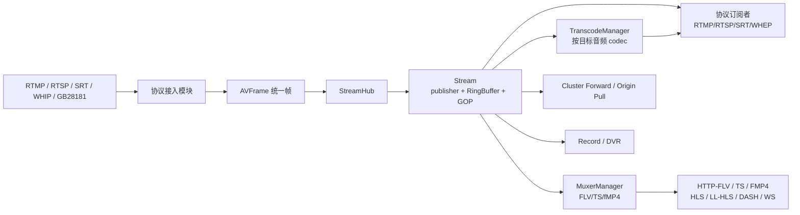
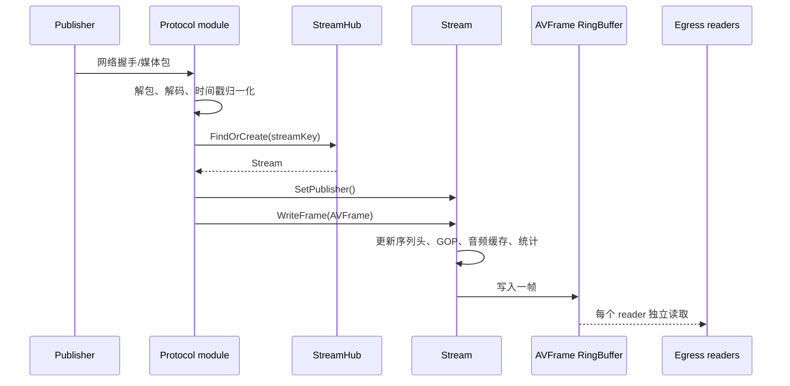
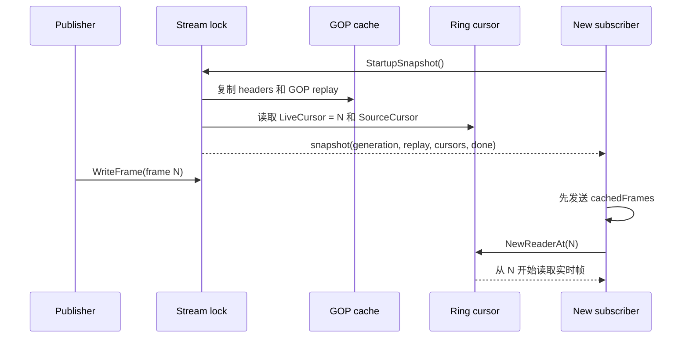
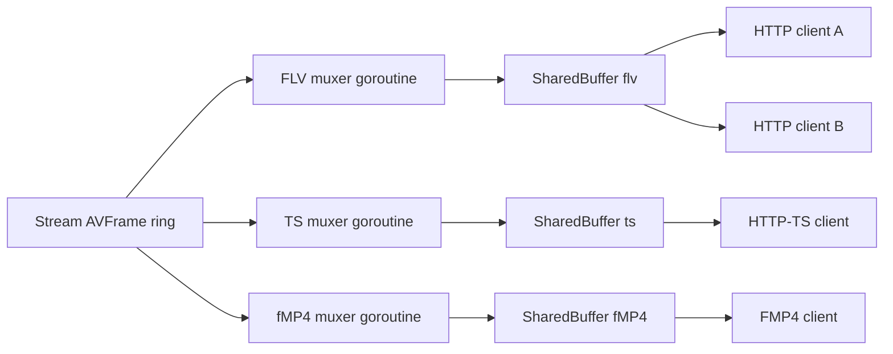
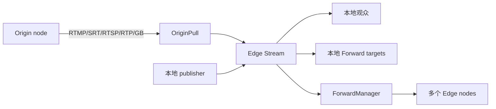

# LiveForge 服务架构分析

本文基于仓库当前源码（而不是 `docs/superpowers/specs/` 中可能尚未落地的设计稿），说明 LiveForge 的进程结构、模块边界、媒体数据流、转发、GOP 缓存、RingBuffer、转码和生命周期管理。阅读本文时，可把它当作源码导航和容量评估的补充，而不是新的接口规范。

## 1. 服务定位

LiveForge 是一个单进程、模块化的 Go 直播服务器。不同协议的输入先被解码为统一的 `AVFrame`，写入同一个 `Stream`；输出侧按协议读取该流，再进行协议封装或按需转码。因此，协议互通的关键不是在每一对协议之间编写适配器，而是所有模块共享 `core.StreamHub` 和 `core.Stream`。



### 设计原则

- **统一时钟和帧模型**：`DTS`、`PTS` 使用毫秒，payload 保留原 codec 数据，不夹带容器头。
- **单 publisher、多 reader**：一个 stream key 同时只接受一个 publisher；每个消费方拥有独立 cursor，不会因另一个消费者读取而消耗数据。
- **缓存与实时连续**：新订阅者先拿到关键帧起始的历史数据，再从同一快照 cursor 继续实时数据。
- **协议状态隔离**：共享的是帧或已 mux 的字节；SSRC、RTP sequence、RTMP chunk 状态等连接状态仍属于单个连接。
- **按需资源**：muxer、音频转码轨道、origin pull 和 forward target 都在真正需要时建立，并在无消费者或关闭时回收。

## 2. 进程启动和模块依赖

入口是 [`cmd/liveforge/main.go`](../cmd/liveforge/main.go)。启动步骤如下：

1. 读取 bootstrap 配置并创建 `core.Server`、运行时配置管理器、`StreamHub` 和 `EventBus`。
2. 按依赖顺序注册模块：`auth`、`rtmp`、`rtsp`、`httpstream`、`srt`、`webrtc`、`sip`、`gb28181`、`sipgateway`、`notify`、`cluster`、`api`、`record`、`dvr`、`metrics`。
3. `Server.Init()` 按注册顺序调用各模块 `Init()`，收集监听器和事件 hook，最后启动 alive loop。
4. 若初始化失败，只关闭已经尝试初始化的模块，并按逆序关闭；原始错误被保留，未尝试初始化的模块不会被误关闭。
5. 正常关闭时同样按逆序调用 `Close()`，RingBuffer 和等待中的 reader 会被唤醒。

模块通过 [`core/module.go`](../core/module.go) 中的 `Module`、`Reloadable`、`ReloadPreparer`、`ConfigApplied` 和 `EndpointProvider` 接口参与生命周期。鉴权模块必须先注册，因为它为后续协议的 publish/subscribe 事件安装同步 hook。

## 3. 模块分层和职责

| 层次 | 主要目录 | 职责 | 共享对象 |
| --- | --- | --- | --- |
| 进程编排 | `cmd/liveforge`, `core/server.go` | 启动、关闭、配置应用、模块顺序 | `Server` |
| 核心流中心 | `core/stream_hub.go`, `core/stream.go` | stream 查找/创建、publisher、subscriber、缓存和统计 | `StreamHub`, `Stream` |
| 媒体原语 | `pkg/avframe`, `pkg/rtp`, `pkg/muxer`, `pkg/util` | 帧、RTP、FLV/TS/fMP4、RingBuffer | `AVFrame`, `RingReader` |
| 接入/播放 | `module/rtmp`, `rtsp`, `srt`, `webrtc`, `gb28181` | 网络握手、协议解析、帧封装和解封装 | `Stream` |
| HTTP 分发 | `module/httpstream` | 共享 muxer、HLS/LL-HLS/DASH、HTTP-FLV/TS/FMP4/WS | `MuxerManager`, `SharedBuffer` |
| 跨节点 | `module/cluster` | forward、origin pull、传输注册、调度和健康检查 | `RelayTransport`, `RingReader` |
| 媒体处理 | `core/transcode_manager.go` | 按目标音频 codec 建立共享转码轨 | `TranscodedTrack` |
| 持久化 | `module/record`, `module/dvr` | 文件录制、关键帧切片、时移索引 | 独立 reader |
| 控制面 | `module/api`, `auth`, `notify`, `metrics` | REST/console、鉴权、通知、Prometheus | `EventBus` |
| 国标/SIP | `module/sip`, `module/gb28181`, `module/sipgateway` | SIP 信令、设备生命周期、RTP/PS 媒体 | SIP service、`Stream` |

模块之间尽量通过核心接口和事件通信。协议模块不直接调用其他协议模块，避免形成 RTMP→WebRTC、RTSP→HLS 等成对依赖。

## 4. 核心对象模型

### 4.1 StreamHub

[`core/stream_hub.go`](../core/stream_hub.go) 维护 `map[string]*Stream`，stream key 是所有协议的汇聚键。它负责：

- 查找、创建和删除 `Stream`；
- 执行 `max_streams` 限制；
- 为新 stream 创建主 RingBuffer、MuxerManager、FeedbackRouter；
- 在启用 `audiocodec` 时挂接 `TranscodeManager`；
- 协调 idle/no-publisher 超时后的销毁。

### 4.2 Stream

一个 `Stream` 对应一个逻辑流和一个 publisher。状态包括：

| 状态 | 含义 |
| --- | --- |
| `idle` | 尚未发布，可能等待订阅触发回源 |
| `waiting_pull` | 集群语义中的等待回源阶段 |
| `publishing` | 已绑定 publisher，持续接收帧 |
| `no_publisher` | publisher 已断开，但仍可能保留订阅者和缓存 |
| `destroying` | 已进入清理流程 |

Stream 内部持有：

- 主 `RingBuffer[*avframe.AVFrame]`；
- 最近若干 GOP 和可选的音频时间缓存；
- 视频/音频 sequence header；
- `MuxerManager`、`FeedbackRouter`、`TranscodeManager`；
- 按协议统计的 subscriber 数量和流量统计；
- publisher、生命周期状态以及 idle/no-publisher 定时器。

`SetPublisher()` 拒绝重复 publisher；重新发布时会取消旧定时器并重置转码轨道。publisher 断开后转为 `no_publisher`，由 `no_publisher_timeout` 控制清理；无 publisher 且无 subscriber 时由 `idle_timeout` 控制清理。

### 4.3 AVFrame

[`pkg/avframe/frame.go`](../pkg/avframe/frame.go) 定义统一媒体帧：

```text
MediaType: Video / Audio
Codec: H264/H265/AV1/VP8/VP9、AAC/Opus/MP3/G711/G722/G729/Speex...
FrameType: Keyframe / Interframe / SequenceHeader
DTS, PTS: 毫秒时间戳
Payload: 原始 codec payload，不包含 FLV、TS、RTP 等容器或传输封装
```

接入模块负责把网络时间戳归一化到这个模型；输出模块再把它转回各协议需要的单位和封装。

## 5. 推流数据流

无论输入来自 RTMP、RTSP、SRT、WHIP 还是 GB28181，路径都可以抽象为：



`Stream.WriteFrame()` 在 stream mutex 下完成缓存和 ring 写入，保证 GOP 快照与 ring cursor 可以建立一致关系。超过 `max_bitrate_per_stream` 时，序列头仍可写入，但普通帧会被拒绝。

### 5.1 各输入协议的转换

- **RTMP publish**：handshake、chunk 和 AMF0 解析后，将 FLV video/audio message 转为 `AVFrame`；sequence header 同步到 publisher `MediaInfo`。
- **RTSP publish**：ANNOUNCE SDP 建立 codec/PT 映射；RTP depacketizer 按 marker 聚合 access unit，再将 RTP 时间戳归一化为毫秒。
- **SRT publish**：从 SRT stream ID 确定操作，解析 MPEG-TS，提取音视频帧。
- **WHIP publish**：SDP offer 协商后接收 RTP；音视频使用会话级 RTP clock 和 packet-arrival offset 对齐，避免两个 track 产生固定时间偏移。
- **GB28181**：SIP INVITE/SDP 完成会话，接收 PS over RTP；完整 PS pack 聚合后由 MPEG-PS demuxer 生成 AVFrame。

## 6. Stream 写入、序列头和缓存路径

每次 `WriteFrame()` 的顺序如下：

1. 检查每流码率限制；超过限制时拒绝非序列头帧。
2. 遇到 sequence header，更新视频 SPS/PPS（或 VPS/SPS/PPS）和音频 AudioSpecificConfig，并关闭 `seqHeaderReady`，唤醒等待初始化的订阅者。
3. 视频关键帧开启新的 GOP；视频 interframe 追加到当前 GOP；音频帧追加到当前 GOP，以保持 A/V DTS 顺序。
4. 更新帧数、字节数、码率、帧率等统计。
5. 将同一个 `AVFrame` 指针写入主 RingBuffer。

帧 payload 在核心层不重复复制；复制只发生在需要隔离生命周期的已 mux 字节（如 SharedBuffer）或快照切片时。消费者不能修改共享的 `AVFrame` 内容。

## 7. GOP 缓存设计

### 7.1 缓存内容

GOP 缓存由最近 `GOPCacheNum` 个视频 GOP 组成。每个 GOP 从视频关键帧开始，包含后续视频帧，并混入时间范围内的音频帧；因此它不是“只缓存视频帧”的数组。sequence header 单独保存，不计入 GOP 帧列表。`GOPCacheDetail()` 可统计总帧、音视频帧数和 DTS 时长。

纯音频流没有视频关键帧，因此不生成 GOP 启动历史；延迟加入的订阅者从原子捕获的 live cursor 开始接收后续帧。核心不会为纯音频维护独立的启动缓存。

视频关键帧到来时，代码先记录当前 ring write cursor 作为 `gopStart`，再追加新 GOP；超出数量后从最老端裁剪。`GOPCacheSourceStart()` 返回最老 GOP 对应的 ring 位置，转码 worker 需要从历史起点读取时使用它。

### 7.2 原子快照

`StartupSnapshot()` 在同一把 Stream 读锁下复制当前 publisher generation 的完整启动状态：`MediaInfo`、音视频 sequence header、GOP replay frames、`LiveCursor`、`SourceCursor`、generation 编号和 `GenerationDone`。`LiveCursor` 指向快照之后的第一帧；`SourceCursor` 指向最老缓存 GOP 的 ring 位置，仅供需要转换历史输入的 worker 使用。兼容调用方仍可使用 `GOPCacheSnapshot()`，但协议订阅和共享 HTTP muxer 使用完整启动快照。



如果 media info、header、缓存和 cursor 分开读取，publisher 可能恰好在调用之间写帧或被替换：订阅者会重复/遗漏边界帧，或者把旧 generation 的初始化状态与新 generation 的媒体混合。原子快照消除了这些窗口。订阅 reader 同时监听 `GenerationDone`；阻塞读取被唤醒后、处理帧前还会调用 `IsPublisherGeneration`，因此 replacement generation 的第一帧不会泄漏给旧订阅者。

### 7.3 不同消费者的起点

- 普通 RTMP、RTSP、SRT、共享 HTTP FLV/TS/fMP4 muxer 和 WHEP：直接媒体 reader 从 `LiveCursor` 读取。live 模式先发送 `ReplayFrames`；WHEP realtime 不发送 replay，并等待 reader 中的首个关键帧。
- RTMP、WHEP 和共享 HTTP muxer 需要转换历史音频时，会建立独立的 audio-only reader，只把 `SourceCursor` 用作转码输入起点；直接视频仍由 `LiveCursor` reader 提供，因此历史转码输出不会重复 replay 视频或启动 header。
- HLS、LL-HLS、DASH 的兼容路径仍使用 combined 历史转码 reader，并按缓存视频 DTS 范围过滤其中可能重复出现的视频帧；这些 segmenter 尚未迁移到独立 direct/audio reader。
- SRT 不再用跨音视频的最大 DTS 过滤 replay/live 重叠；cursor 是唯一重复边界，因此缓存视频 DTS 4000 之后的实时音频 DTS 1000 仍会发送。

## 8. RingBuffer 设计与并发语义

### 8.1 基本模型

[`pkg/util/ringbuffer.go`](../pkg/util/ringbuffer.go) 是泛型 SPMC（single producer / multiple consumer）环形缓冲：

```text
buf:         固定容量 []T
writeCursor: 单调递增的逻辑写位置
RingReader:  每个消费者独立的 readCursor
```

`NewReader()` 从当前仍保留的最老位置开始；`NewReaderAt(pos)` 从指定逻辑位置开始。容量满后静默覆盖最老元素，RingBuffer 不负责无限排队或持久化。

### 8.2 写入和读取

写入者先在 `dataMu.Lock()` 下写 slot，再推进 atomic cursor；读者在 `dataMu.RLock()` 下取 slot，并在锁内再次检查 writer 是否已经追上并覆盖该位置。这个短临界区保证 cursor 与 slot 内容一致，但实现**不是完全 lock-free**。

等待机制分两套：

- 推荐 `RingReader.ReadContext(ctx)` 和 `WaitContext(ctx)`。它们使用 reader 自己的状态配合 `sync.Cond`，取消 context、关闭 reader 或关闭 ring 都能唤醒，多个 reader 之间不会互相偷走唤醒信号。
- `Signal()` 是遗留的共享 channel，多个 reader 可能消费同一个通知；它只适合需要把 ring 通知和其他 channel 混合 select 的旧路径。集群 relay、WHEP feed 和转码 worker 使用 reader-scoped wait，不依赖共享 Signal。

`Read()` 会阻塞等待，不 busy-spin；`Close()` 唤醒所有等待者。关闭单个 `RingReader` 不会影响其他消费者。

### 8.3 覆盖、丢帧和滞后

当 `readCursor < writeCursor - capacity` 时，读者已经落后到被覆盖。`TryRead()` 会跳到最老可用位置，并通过 `Skipped()` 报告本次跳过的帧数。`Lag()` 将滞后量归一化到 `[0, 1]`，1 表示接近被覆盖。

这意味着 RingBuffer 是实时分发缓冲而非可靠队列：慢消费者最终会丢帧，业务层必须决定丢帧、追关键帧还是断开连接。

## 9. SharedBuffer 和 MuxerManager

### 9.1 为什么需要第二层缓冲

主 ring 保存的是 `AVFrame`。HTTP-FLV、HTTP-TS 和 FMP4 需要连续的容器状态（FLV header、PAT/PMT、fMP4 init、fragment sequence 等），如果每个 HTTP 客户端单独 mux，会重复 CPU 和状态管理。因此 HTTP 模块按格式共享一个 muxer。

`core.SharedBuffer` 在 `RingBuffer[[]byte]` 上封装一层；写入单元是已经 mux 的 bytes，每个客户端拿到独立的 `SharedBufferReader`。

### 9.2 MuxerManager 生命周期

对每个 stream，`MuxerManager` 按 `flv`、`ts`、`mp4` 保存 `MuxerInstance`：

1. 第一个该格式订阅者到来时，为当前 publisher generation 创建 SharedBuffer、`Done` channel 和 generation-bound `MuxerInstance`，并启动一个 muxer goroutine。
2. muxer 先捕获与实例 generation 相同的启动快照；尚未 ready 时同时等待该快照的 `GenerationDone`，publisher 被移除就立即退出，不能等待并接入 replacement generation。ready 后向 SharedBuffer 写 init/header、replay，再从 `LiveCursor` 继续直接媒体；转码音频由独立 reader 从 `SourceCursor` 输入。
3. 后续同格式订阅者从共享 bytes reader 读取，不重新创建 muxer。
4. HTTP/WS 请求释放自己实际取得的实例。最后一个订阅者释放或该 publisher generation 结束时关闭 `Done`，muxer 关闭 reader 和 SharedBuffer，实例从 manager 删除；旧请求不能递减 replacement generation 的实例。



RTMP、RTSP、SRT 通常直接读取 AVFrame ring，因为每个连接有独立的 RTMP chunk/FLV 状态、RTP packetizer/SSRC/sequence/timestamp 或 TS 输出状态。当前实现没有旧设计中那种显式 packet ref-count；共享边界是 ring 中的帧指针或 SharedBuffer 中的字节切片。

## 10. 播放和输出路径

### RTMP

RTMP play 在鉴权后查找/创建 stream、增加 subscriber，然后：

1. 等待 sequence header；
2. 发送 FLV sequence header；
3. 发送 GOP snapshot；
4. 从 `LiveCursor` 读取实时 AVFrame，并在每次唤醒后确认 publisher generation 仍匹配；
5. 使用连接私有 FLV muxer 编成 RTMP chunks；
6. 通过 `SlowConsumerFilter` 根据延迟丢弃非关键视频帧。

音频 codec 不兼容时，直接视频仍由主 ring 的 `LiveCursor` reader 提供，另一个 audio-only TranscodeManager reader 从 `SourceCursor` 取得转换输入；兼容时直接读取主 ring。replay 视频、视频 sequence header 和目标音频 header 都只发送一次，之后 publisher 发出的 live sequence header 仍会转发给 RTMP peer。

### RTSP

RTSP 支持 OPTIONS、DESCRIBE、SETUP、PLAY，以及 ANNOUNCE、RECORD、TEARDOWN；传输支持 TCP interleaved、UDP unicast 和 UDP multicast。DESCRIBE 从一个 ready `StartupSnapshot` 生成 SDP，并把同一快照在 session mutex 下保存；PLAY 只能使用该 generation 的 media/header/replay/cursor，若 DESCRIBE 后 publisher 被移除或替换则拒绝播放，不能把旧 SDP 与新媒体配对。每个订阅者独立创建 packetizer、SSRC、sequence 和 RTP timestamp 状态。即使底层都来自同一 RingBuffer，RTP 包不能简单在连接间共享。

### SRT

SRT stream ID 决定 publish 或 subscribe。订阅端从一个启动快照创建 TS muxer，先发送 replay，再从 `LiveCursor` 接续；不使用跨 track 的最大 DTS watermark。live sequence header 会更新已知 codec/header 并重建 TS muxer，立即发送新的 PAT/PMT，再发送该 track 的第一帧；因此晚到的 AAC header 后即使没有视频关键帧，首个音频帧也不会在 video-only PMT 下发送或被丢弃。为抵御 GOP burst，写队列返回 `io.EOF` 时会短暂重试。SRT 订阅也使用慢消费者过滤，并在 generation 结束时退出。

### HTTP-FLV、HTTP-TS、FMP4

这些路径复用上一节描述的格式 muxer：

- FLV：header 和 sequence header 作为 init data，之后共享 FLV tags；
- TS：PAT/PMT 可在关键帧前内联写入；late sequence header 新增或改变 track 时，共享 muxer 会先单独输出刷新后的 PAT/PMT，再无重复地输出该 track 的第一帧；
- FMP4：init segment 单独输出，GOP 作为首个 fragment，实时帧大约按 200ms 聚合；建线时 rebasing DTS/PTS，但保留 B-frame 的 signed composition offset。

### HLS、LL-HLS、DASH

HLS/LL-HLS/DASH 在 HTTP 模块中消费 muxer 输出并按关键帧边界切段：

- HLS 保留滑动窗口；
- LL-HLS 输出 part，支持 blocking playlist reload、`_HLS_msn` 和 `_HLS_part`；冷启动先等待一个完整 segment，避免只公布 part 导致播放器重复 append；
- DASH 分离音视频 init 和 segment，使用精确 `SegmentTimeline`，MPD 返回前至少形成一个完整关键帧分段。

### WebRTC WHEP

WHEP 创建 PeerConnection，根据 offer 的 m-line 和 codec 匹配视频/音频 track。`TrackSender` 独立处理 RTCP、PLI/FIR、NACK 和统计；feed loop 等 ICE/DTLS ready 后再发送媒体。

- `realtime` 模式跳过 GOP，等待下一个 live keyframe；
- `live` 模式发送 GOP，再接续 ring；
- H.264/H.265 将 AVCC/HVCC 转 Annex-B，关键帧前补 parameter sets；Chrome 不可靠处理 H.264 B-frame 时会丢弃 PTS 早于已发送参考帧的 B-frame；
- 若音频需要转码，视频从主 ring 读取，音频使用独立 audio-only 转码 reader，避免音频转码 worker 消费共享 Signal 后造成视频 burst；
- Pion interceptor 提供 GCC pacer、TWCC、NACK 和 RTCP stats，初始 bitrate 按实际流码率加 headroom。

## 11. 集群转发和回源

### 11.1 TransportRegistry

[`module/cluster`](../module/cluster) 通过 URL scheme 选择 `RelayTransport`：

| scheme | 用途 |
| --- | --- |
| `rtmp` | RTMP connect/createStream/publish 或 play |
| `srt` | SRT push/pull |
| `rtsp` | ANNOUNCE/RECORD 或 DESCRIBE/PLAY，支持 TCP interleaved |
| `rtp` | HTTP SDP signaling + UDP RTP/RTCP |
| `gb` | GB28181 SDP signaling + PS over RTP |

统一接口为 `Push(ctx, targetURL, stream)`、`Pull(ctx, sourceURL, stream)` 和 `Close()`，协议差异封装在 transport 内部。

### 11.2 Forward

ForwardManager 监听异步 `EventPublish`：

1. scheduler 从静态目标列表或 HTTP schedule URL 解析目标；
2. health filter 过滤不健康节点；
3. 每个目标建立独立 `ForwardTarget` 和 goroutine；
4. target 自己创建 RingReader，读取主 ring 并调用 transport.Push；
5. 失败按指数退避重试，退避上限 30 秒；`ErrCodecMismatch` 不重试；
6. 关闭 publisher 或模块时关闭 target，释放连接池和 reader。

每个 target 都有独立 cursor，因此一个边缘节点慢不会阻塞其他节点。高并发 relay 使用 `ReadContext`，RTMP push 复用 FLV encoding state，RTSP interleaved 尽量使用 `net.Buffers`/writev；relay 字节指标首包立即记录，后续累计到 64 KiB 或操作结束时刷新。

### 11.3 Origin Pull

OriginManager 监听异步 `EventSubscribe`。当本地 stream 没有 publisher 时：

1. 根据 stream key 解析源站列表；
2. 对同一 stream 保证只有一个 OriginPull；
3. 选择 transport，按顺序尝试源站并重试；
4. 远端收到的帧直接写入本地 Stream，所有本地订阅者继续走普通输出路径；
5. 无订阅者达到 idle timeout 后取消 pull。

这使边缘节点只在有观众时回源，并且回源媒体一旦进入本地 stream，就能同时服务 RTMP、HLS、WHEP 等不同输出。



## 12. 音频转码

`core.TranscodeManager` 只在启用 `audiocodec` 构建且确实存在 codec 不匹配时工作：

- 目标 codec 与 publisher codec 相同：直接返回主 ring 的 reader，零转码开销；
- 目标 codec 不同：按目标 codec 创建或复用一个 `TranscodedTrack`；
- 每条 track 由一个 goroutine 解码、重采样、编码并写入自己的 RingBuffer；多个相同目标 codec 的订阅者共享这条 track；
- publisher 重新发布时 `Reset()` 取消所有旧轨道，避免旧 codec 的输出混入新会话。

普通 `GetOrCreateReaderAt()` 从当前转码输出 cursor 开始，适合只需要实时数据的连接；HTTP muxer 使用 `GetOrCreateReaderAtFromHistory()`，从仍保留的转码输出最老位置开始，以重放 GOP 中的历史音频。WHEP 使用 `GetOrCreateAudioReaderAt()`，因为视频仍由主 ring reader 提供，音频不能和视频共享一个转码 reader。

转码轨道的源起点通常为 `GOPCacheSourceStart()`。这样可覆盖缓存 GOP 的音频，同时继续消费 live 音视频；HTTP 输出会用视频 DTS watermark 去掉已经在缓存中发送过的转码视频。

没有 `audiocodec` 标签或 FFmpeg/libav 开发库时，服务仍可运行和转发兼容 codec，但不能把音频转码能力描述为可用。发布二进制采用便携 no-CGO profile。

## 13. 慢消费者、丢帧和背压

`core/slow_consumer.go` 用 RingReader 的 `Lag()` 和发送耗时 EWMA 判断消费者状态：

| 状态 | 行为 |
| --- | --- |
| `Normal` | 发送所有允许的帧 |
| `DropNonKey` | 保留关键帧、sequence header 和音频，丢视频 interframe |
| `SkipToKey` | 丢视频直到下一个关键帧，仍可发送音频和 sequence header |

进入和恢复阈值不同，形成 hysteresis，避免状态抖动。若 RingBuffer 持续覆盖并在滑动窗口内超过 SkipTracker 阈值，订阅者会被断开，而不是无限发送过时画面。

RTMP 和 SRT 直接使用 `SlowConsumerFilter`。HTTP muxer 位于最终用户 reader 之前，通常通过 SharedBuffer 让同格式用户共享封装结果；因此 HTTP 慢客户端表现为它自己的 SharedBuffer reader 滞后，不能把 HTTP muxer 简化成每个用户一个 AVFrame filter。

## 14. 事件、鉴权和生命周期

`core.EventBus` 事件包括 stream create/destroy、publish/stop/republish、subscribe/stop、alive、keyframe、audio header、forward、origin pull 和 subscriber skip。

- 同步 hook 按 priority 执行；任一错误立即返回，适合鉴权和准入控制；
- 异步普通事件直接启动 goroutine；
- publish/subscribe 生命周期事件按 `(streamKey, clientID, consumer)` 建立有序 lane，单 lane 队列上限 8、总 lane 上限 4096；超限返回 `ErrAsyncBackpressure`，避免无界堆积；
- 异步分发前复制 `EventContext` 的 Params/Extra，避免 handler 间数据竞争。

auth 模块以同步 priority 10 hook 参与 publish/subscribe；cluster、record、dvr、notify 等业务模块通常异步处理。管理 API 的 bearer token 或 console session 保护管理和 GB28181 接口，`GET /api/v1/server/health` 保持公开。

## 15. 录制、DVR、通知和监控

- **Record**：监听 publish 生命周期，创建自己的主 ring reader；先写 sequence header，再写 FLV、fMP4、MP4、TS 或 HLS；结束时 drain 待处理帧、关闭 writer，并记录 completed/failed。没有媒体帧的会话保留为 failed，不伪装成可播放文件。
- **DVR**：独立 reader 读取主 ring，用 TS muxer 按关键帧和 segment duration 切片。partial 文件完成后才发布为正式 segment，维护窗口和索引，并在自己的 listener 提供时移 HLS。
- **Notify**：把异步生命周期事件发送到 HTTP webhook 或 WebSocket；webhook 使用 HMAC-SHA256 签名。
- **Metrics**：Prometheus collector 汇总 server、stream、协议订阅者、GOP、转发、录制和 DVR 指标。转发字节计数做了批量提交，减少每帧指标开销。
- **API/Console**：REST、RBAC、配置、cluster、SIP/GB、录制/DVR、审计和协议实验室属于控制面，不直接参与媒体热路径。

## 16. 配置和可变性边界

运行时配置管理器从 file、HTTP/HTTPS、Consul 或 Redis 读取文档，解析、规范化、验证、计算 hash 后以不可变 snapshot 原子发布。普通读取只做 atomic pointer load；source I/O、Apply 写入和 close 通过可取消 gate 串行化。

可热更新的通常是策略值，例如重试、鉴权规则、慢消费者阈值或通知策略。listener 地址、端口范围、模块启停、TLS 文件/模式、RingBuffer 容量和音频 codec enablement 会改变资源拓扑，通常标记为 `restart_required`。RingBuffer 和 muxer capacity 不在已有 Stream 上原地扩容；新 stream 使用新的结构参数。

本地样例 [`configs/liveforge.yaml`](../configs/liveforge.yaml) 关闭了 TLS/鉴权并使用 `admin/admin`，只能用于本机开发，不能直接暴露公网。

## 17. 容量和故障分析要点

### 内存估算

主 RingBuffer 的粗略内存为：

```text
ring_capacity × (AVFrame 指针 + frame 对象 + payload)
+ GOPCacheNum × GOP 平均帧数 × frame/payload 引用
+ 每种 HTTP 格式一个 SharedBuffer（capacity × packet bytes）
+ 每个转码目标 codec 一个 TranscodedTrack ring
```

GOP 和音频缓存保存的是 frame 指针，payload 生命周期由 publisher/帧对象管理；SharedBuffer 写入 muxed bytes，通常会产生新的 byte slice。增大 ring 容量可以容忍更多慢消费者，但会增加每个 stream 的内存，不能替代慢消费者策略。

### 延迟和连续性

- 起播延迟主要由 GOP 长度、缓存是否开启、muxer 首个 fragment/segment 形成时间决定；
- RingBuffer 覆盖会造成不可恢复的跳帧，SlowConsumerFilter 的目标是尽快跳到可解码关键帧；
- 转码增加 CPU 和队列延迟，按目标 codec 共享 track 可减少重复编码；
- WHEP 的 live 模式为了首帧连续会发送缓存 GOP，realtime 模式则牺牲起播历史以降低等待。

### 需要重点观测的指标

- stream publisher/subscriber 数、输入/输出码率和帧率；
- GOP 数、GOP 时长、sequence header 是否到达；
- RingReader `Lag()`、`Skipped()` 和 subscriber skip/disconnect 事件；
- muxer instance 数量与 SharedBuffer reader 数；
- 转码 track 数、编码错误和释放延迟；
- forward/origin 的连接状态、重试次数、首包延迟、字节数和失败原因；
- record/DVR session 的 completed/failed、segment 窗口和存储错误。

## 18. 当前实现边界

以下边界应在集成和运维文档中保持明确：

1. RingBuffer 是 SPMC、固定容量、覆盖式缓存，不是持久化队列；实现使用 atomic cursor 加短临界区锁，不是完全无锁。
2. `Signal()` 是共享遗留通知；高并发路径必须使用 `ReadContext`/`WaitContext`，否则多个 reader 可能互相消费唤醒。
3. HTTP 同格式订阅者共享 muxed bytes；RTSP/RTP 的 packetizer、SSRC、sequence 和 timestamp 状态仍是 per-subscriber。
4. GOP 缓存包含按 DTS 混入的音频帧，并且只保留最近 N 个 GOP；它不保证任意时间点的历史回放。
5. 音频转码需要 `audiocodec` + CGO + FFmpeg/libav；无该构建 profile 时只能使用兼容 codec 的透传路径。
6. Stream、RingBuffer 容量和监听器等结构资源通常需要重启，运行时 reload 不会无损改变已有 reader 的容量。
7. simulcast layer selection 仍未实现，不应把相关配置描述成已经具备运行时选层能力。

## 19. 代码导航

| 主题 | 入口 |
| --- | --- |
| 服务和模块生命周期 | [`core/server.go`](../core/server.go)、[`core/module.go`](../core/module.go) |
| stream 状态、写入、GOP/音频缓存 | [`core/stream.go`](../core/stream.go)、[`core/stream_hub.go`](../core/stream_hub.go) |
| RingBuffer/SPMC | [`pkg/util/ringbuffer.go`](../pkg/util/ringbuffer.go) |
| SharedBuffer/muxer 生命周期 | [`core/shared_buffer.go`](../core/shared_buffer.go)、[`core/muxer_manager.go`](../core/muxer_manager.go) |
| 音频转码 | [`core/transcode_manager.go`](../core/transcode_manager.go)、`pkg/audiocodec` |
| 慢消费者 | [`core/slow_consumer.go`](../core/slow_consumer.go) |
| 事件和生命周期 lane | [`core/event_bus.go`](../core/event_bus.go) |
| HTTP muxer/HLS/DASH | [`module/httpstream`](../module/httpstream) |
| WebRTC WHIP/WHEP | [`module/webrtc`](../module/webrtc) |
| 集群 forward/origin/transport | [`module/cluster`](../module/cluster) |
| SIP/GB28181 | [`module/sip`](../module/sip)、[`module/gb28181`](../module/gb28181) |
| 录制和 DVR | [`module/record`](../module/record)、[`module/dvr`](../module/dvr) |

## 20. 验证命令

快速包测试（不要求 FFmpeg）和仓库文档检查：

```bash
go test ./...
tools/check-agent-docs_test.sh
```

完整基线需要 Go 1.26+、FFmpeg 开发库和 `audiocodec` 标签：

```bash
CGO_ENABLED=1 go build -tags audiocodec ./cmd/liveforge
CGO_ENABLED=1 go test -tags audiocodec -race -coverprofile=coverage.out -covermode=atomic ./...
```

RingBuffer、Stream、SharedBuffer、慢消费者和转发热路径可按需聚焦：

```bash
go test -run 'TestRing|TestStream|TestSharedBuffer|TestSlowConsumer' ./core ./pkg/util
go test -bench='BenchmarkRingReader|BenchmarkRTMPConn' -benchmem ./pkg/util ./module/cluster
```
